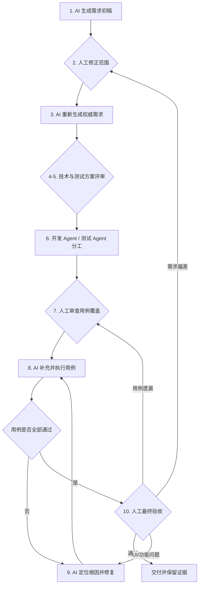

# AI 与人工协作过程说明

## 文档目的与核心结论

本文以“信证台 DID/VC Learning Lab”项目为背景，说明从初始需求、需求修正、技术选型、代码实现、测试设计、缺陷修复到人工验收的完整 AI 与人协作过程。

这一过程的核心不是“让 AI 独立完成项目”，而是根据不同阶段的特点分配职责：

- **人工负责确定目标、边界、优先级和验收标准，并承担最终决策责任；**
- **AI 负责读取项目、识别冲突、整理方案、维护追踪关系和组织执行；**
- **开发 Agent 与测试 Agent 在明确任务边界下分工，但共享已确认的需求和接口契约；**
- **每个关键阶段设置人工确认点，确认未通过时回退到相应阶段，而不是带着错误继续向后执行。**

## 协作角色与职责

| 角色 | 主要职责 | 不应独立承担的责任 |
|---|---|---|
| 人工需求方与评审者 | 提出业务目标，修正需求范围，确认方案、优先级和完成标准，执行最终验收 | 不应在没有技术事实的情况下强行指定不可行实现 |
| 需求分析 AI | 检查项目现状，识别歧义和冲突，比较方案，生成需求、设计和计划，维护一致性 | 不应独立决定业务范围、风险接受和最终验收 |
| 开发 Agent | 根据已批准的需求和计划编写代码，执行专项测试，保持变更可回溯 | 不应为了让代码更容易实现而擅自修改需求 |
| 测试 Agent | 从需求和风险出发设计正常、异常、边界、安全和用户场景，运行测试并产生证据 | 不应只照抄开发 Agent 的实现逻辑，否则会把同一错误同时写入代码和测试 |

## 1. AI 根据初始需求生成需求初稿

**阶段目标：** 将用户的初始想法转化为可讨论的结构化需求初稿，并建立后续澄清的共同基础。

**输入材料：** 用户提出的业务目标、现有项目源码、API、测试、README 与既有产品文档。本项目的初始目标包括 DID/VC 创建签发验证、生命周期、模糊搜索、分页和时间倒序。

**AI/Agent 工作：** 需求分析 AI 先读取项目现状，区分“已实现”、“可复用”、“需要扩展”和“必须由用户决策”的内容。随后给出需求初稿，列出产品目标、角色、主流程、功能模块、初步数据模型与待确认问题。

**人工工作：** 判断需求初稿是否符合项目目标，指出 AI 对业务背景的误解、范围遗漏和不合理假设。

**主要输出：** 需求初稿、现状分析、已知约束、待确认问题清单。

**人工确认点：** 初稿能否作为下一轮讨论基础，而不是判定它已经是最终需求。

**不通过时的回退：** 补充业务背景或要求 AI 重新检查代码与文档，然后重新生成初稿；不进入技术选型和开发。

## 2. 人工修正需求范围，补充生命周期与日志

**阶段目标：** 由人工对 AI 初稿进行业务审查，将“能完成主流程”扩展为“能处理完整生命周期并可审计”。

**输入材料：** 需求初稿、用户对实际演示流程的预期、需要补充的 DID/VC 状态与日志查看要求。

**AI/Agent 工作：** 对人工补充内容进行影响分析，指出哪些模块、数据模型、接口和测试会受到影响，并提出需要进一步确认的状态转换、不可逆操作与日志脱敏规则。

**人工工作：** 确认 DID 更新、轮换、停用，VC 暂停、恢复、替代、过期与撤销等范围；确认日志需覆盖成功和失败的业务操作及系统异常。

**主要输出：** 经人工修正的需求范围、生命周期状态清单、日志模块目标与隐私约束。

**人工确认点：** 新增范围是否必须在当前阶段完成，哪些能力需要明确排除。

**不通过时的回退：** 回到范围划分，按“必须、应当、可以延后”重新排序，避免在范围不清时进入详细设计。

## 3. AI 根据新范围重新生成权威需求文档

**阶段目标：** 将人工修正后的范围转换为内部一致、可实施、可测试的权威需求基线。

**输入材料：** 需求初稿、人工修正意见、生命周期规则、日志目标、现有代码约束。

**AI/Agent 工作：** 重写产品目标、范围与非范围，定义角色、状态机、数据模型、API 契约、页面行为、错误处理、安全隐私、旧数据兼容和完成标准。同时检查各章节是否相互矛盾。

**人工工作：** 逐项审核业务语义，特别关注停用、撤销、替代、日志保留、隐私脱敏和本期不实现能力。

**主要输出：** 权威需求说明书、状态转换表、能力矩阵、API 与页面验收标准。

**人工确认点：** 文档能否作为后续技术选型、开发和测试的唯一需求基线。

**不通过时的回退：** 回到第 2 阶段修正范围或回到本阶段重写冲突章节；未通过前不向 Agent 下发实施任务。

## 4. 人工确认后，AI 分别进行技术选型和测试场景设计

**阶段目标：** 将已批准需求分解为“如何实现”和“如何证明”两条相互独立又彼此对齐的工作线。

**输入材料：** 权威需求文档、项目架构、现有依赖、运行环境、已知风险和完成标准。

**AI/Agent 工作：** 一条工作线比较技术方案、数据模型、模块边界和迁移影响；另一条工作线从需求和风险出发设计正常、异常、边界、安全、兼容和端到端场景。

**人工工作：** 为技术选型提供时间、复杂度和教学展示等约束；对测试场景提供业务优先级和重点风险。

**主要输出：** 技术方案比较、推荐方案、架构设计草案、测试矩阵和高风险场景清单。

**人工确认点：** 方案是否满足需求且复杂度可控，测试是否真正围绕需求和风险，而不是只验证现有代码。

**不通过时的回退：** 技术不可行时重新比较方案；测试与需求无法一一对应时，返回第 3 阶段澄清验收标准。

## 5. 人工确认技术选型和测试场景设计

**阶段目标：** 将技术与测试方案从“建议”转换为可以下发给 Agent 的已批准基线。

**输入材料：** 技术方案比较、设计草案、测试矩阵、风险清单和工期约束。

**AI/Agent 工作：** 说明各方案权衡，对人工问题提供技术事实，并将确认后的结论写入设计文档、测试方案和任务计划。

**人工工作：** 在了解权衡后选择方案，确认测试层级、优先级、用例颗粒度和人工验收范围。

**主要输出：** 已批准技术设计、测试方案、接口契约、数据模型和可执行计划。

**人工确认点：** 用户明确表示同意架构、Method 能力、状态机、测试范围和教学实现边界。

**不通过时的回退：** 对被拒绝的选项说明原因，回到第 4 阶段修改方案；不得在方案尚未批准时提前实现。

## 6. 由开发 Agent 和测试 Agent 分别生成代码与测试用例

**阶段目标：** 在共享需求基线的前提下，将“实现功能”和“独立验证功能”分工，降低自证正确带来的偏差。

**输入材料：** 权威需求、技术设计、实施计划、测试矩阵、公共接口契约和共享测试数据规则。

**AI/Agent 工作：** 开发 Agent 按 TDD 完成最小实现、模块集成和代码提交；测试 Agent 根据需求独立拆分用例，包括正常、异常、边界、安全、UI 与端到端场景。协调 AI 管理任务边界和交付顺序。

**人工工作：** 审查任务分工是否清晰，检查测试 Agent 是否从需求而非从实现细节出发。

**主要输出：** 项目代码、单元/集成/API/功能/安全/UI 用例、测试夹具、执行脚本和分阶段提交。

**人工确认点：** 开发与测试是否共同对齐需求，但不是彼此复制；敏感功能是否具有独立的失败测试。

**不通过时的回退：** 接口认知不一致时回到第 5 阶段固化契约；任务耦合时重新切分 Agent 边界；不通过的代码不进入人工验收。

## 7. 人工评审测试用例覆盖性并提供补充方向

**阶段目标：** 检查自动生成的用例是否真正覆盖用户关心的功能与风险，而不是只在数量上显得充足。

**输入材料：** 测试用例表、自动化脚本、需求追踪矩阵、已实现页面和高风险清单。

**AI/Agent 工作：** 生成覆盖统计，将用例映射到需求、模块和自动化脚本，说明尚未执行、仅被间接覆盖或缺少用户操作的区域。

**人工工作：** 从用户角度检查创建、签发、验证、台账、日志、搜索、空状态、错误提示和移动端交互。对遗漏提出明确补充方向。

**主要输出：** 覆盖性评审结论、缺口清单、新增用例优先级和人工验收清单。

**人工确认点：** 测试是否覆盖主要用户旅程、七项完整验证、生命周期终态、安全边界和页面可见结果。

**不通过时的回退：** 回到第 4 或第 6 阶段补充测试场景和脚本；如果发现需求本身无法验收，则回到第 3 阶段修订完成标准。

## 8. AI 重新生成用例并执行功能验证

**阶段目标：** 将人工覆盖性评审结果落实为新用例和自动化脚本，并用实际执行证明功能。

**输入材料：** 缺口清单、新增用例方向、当前代码、测试夹具与执行环境。

**AI/Agent 工作：** 测试 Agent 补充用例，运行单元、集成、API、功能、安全和 UI 测试，保留失败名称、日志、截图、视频或 trace。AI 分析失败属于功能缺陷、测试构造错误、环境问题还是需求歧义。

**人工工作：** 审查新用例是否符合补充方向，检查自动化是否真正执行，不把 AI 的“已通过”表述当作唯一证据。

**主要输出：** 更新后的用例表、自动化脚本、测试报告、失败清单和本地证据批次。

**人工确认点：** 执行记录是否对应当前代码和环境，失败是否被正确分类，新用例是否真正提高了覆盖性。

**不通过时的回退：** 用例无效时回到第 7 阶段重新设计；功能失败时进入第 9 阶段；需求不清时回到第 3 阶段。

## 9. AI 根据用例失败结果定位并修复缺陷

**阶段目标：** 根据可重现的失败证据定位根因，使用最小修复恢复正确行为，并通过回归测试防止复发。

**输入材料：** 失败用例、错误堆栈、请求与响应、持久化状态、结构化日志、UI 截图/trace 和近期变更。

**AI/Agent 工作：** 重现失败，沿数据流从现象追踪到根因，区分代码缺陷与测试缺陷；在失败用例保留的前提下实施单一修复，运行专项和全量回归。

**人工工作：** 确认修复符合原需求，检查 AI 是否只消除表面现象或通过放宽测试来获得“通过”。

**主要输出：** 根因说明、修复代码、防回归用例、专项与全量测试证据。

**人工确认点：** 原失败能否稳定重现，修复后是否稳定通过，其他功能是否未受损害。

**不通过时的回退：** 回到根因调查而不是叠加猜测性修复；如果连续多次修复暴露跨模块结构问题，应暂停并返回第 4–5 阶段重新审视架构。

## 10. AI 用例全部通过后，由人工执行最终验收

**阶段目标：** 在自动化证据达标后，由人工确认系统是否真正满足业务目标、页面体验和答辩演示要求。

**输入材料：** 已通过的自动化批次、需求验收标准、人工清单、测试日志、Playwright 报告、截图/视频/trace、Git 版本和证据校验和。

**AI/Agent 工作：** 准备验收环境与演示数据，按清单辅助导航，展示已知边界，但不替代人工宣告项目验收通过。

**人工工作：** 实际操作 DID 创建、VC 签发、七项完整验证、篡改检测、生命周期、选择性披露、日志和重置；检查桌面与移动视口，评估系统是否符合讲解和使用预期。

**主要输出：** 人工验收记录、通过/不通过结论、剩余问题、已知限制和交付意见。

**人工确认点：** 人工是否在真实页面上看到与需求一致的行为，已知边界是否可接受，项目是否可以正式交付。

**不通过时的回退：** UI/交互问题返回第 9 阶段定位修复；用例遗漏返回第 7–8 阶段；需求不符合实际目标则返回第 2–5 阶段重新决策。

## 开发 Agent 与测试 Agent 的并行协作

“由两个 Agent 分别生成代码和测试用例”的价值，在于视角隔离，而不是让两个 Agent 完全互不沟通。

两者共享：

- 已经人工批准的需求和完成标准；
- API、数据模型和状态机契约；
- 统一的错误码和测试数据边界；
- 任务依赖、文件所有权和变更范围。

但测试 Agent 应优先读取需求和风险，而不是将开发 Agent 的代码重写一遍作为“测试”。例如，开发 Agent 实现 DID 停用时，测试 Agent 不仅要检查状态字段，还要验证停用不可逆、不能轮换、不能签发新 VC、历史签名仍可计算但完整验证失败，以及前端不再提供非法操作入口。

两个 Agent 对契约理解不一致时，不应各自猜测。应将分歧上报给协调 AI 和人工评审者，由人工确认业务语义，再同步修订需求、设计和测试。

## 需求到交付的追踪关系

| 需求/决策 | 设计或契约 | 实现 | 测试与证据 | 人工验收 |
|---|---|---|---|---|
| DID 双 Method | Registry + Example/Key Adapter + 能力声明 | `did-methods.js`、DID 创建与解析 | 四种 Issuer/Holder 组合、未知 Method 失败 | 创建两种 DID，检查按钮能力差异 |
| DID 生命周期 | 版本、历史密钥、不可逆停用 | `vc-service.js`中更新/轮换/停用 | 版本冲突、新旧 VC 验签、停用后禁止签发 | 页面操作更新、轮换和停用 |
| VC 完整验证 | 七项独立检查 | `verifyCredential()` | 篡改、过期、撤销、DID 停用和密钥版本失败 | 查看逐项结果和失败原因 |
| 结构化日志 | correlationId、留存上限、递归脱敏 | `log-service.js`、`log-store.js` | 成功/失败、筛选、清空摘要、敏感字段 | 查看日志详情，确认可追踪且无泄密 |
| 选择性披露 | 加盐摘要 + Issuer 摘要清单签名 | 披露表达创建与验证 | 披露字段、篡改、历史密钥和状态 | 只披露课程/日期，验证成功与篡改失败 |

追踪关系的作用不是为了增加文档数量，而是为了回答：每一行代码在实现哪条已确认需求，每一条测试在证明什么，每一个失败应回到哪一阶段处理。

## 项目中的真实协作案例

### DID Method 选型纠偏

人工提出密钥轮换需求后，AI 发现原有 `did:key` 因 DID 由公钥派生，无法在保持 DID 不变时更换公钥。AI 提出双 Method 方案，用户确认后，使用 `did:example` 演示更新、轮换和停用，保留 `did:key` 演示自认证、不可更新身份。

### 日志需求逐步完整化

人工最初只要求查看操作成功和失败记录。AI 协助将它拆分为审计日志与系统日志，再通过人工确认形成级别、关联 ID、组合筛选、独立存储、5,000 条留存、清空摘要和递归脱敏等完整要求。

### 测试覆盖由人工反向补充

初版测试对服务和 API 覆盖较多，但人工审查发现，“API 能暂停 VC”不等于“用户能在签发页台账点击暂停并看到状态同步”。人工因此要求补充用户功能用例、台账同步、失败原因、空状态、错误提示和移动端布局，AI 和测试 Agent 再据此重新生成用例。

### 并发写入缺陷

集成测试曾发现并发创建两个 DID 后只保留一条记录。AI 追踪后确认，原存储只将最终写入串行化，没有将整个“读取—修改—写入”加入事务队列。开发 Agent 修复后，测试 Agent 保留并发回归用例，人工则确认修复的是数据完整性根因，而非只是表面时序。

### 真实浏览器验收

单元测试通过后，人工仍发现隐藏单选框和日志筛选栏导致的页面溢出。AI 通过真实浏览器定位根因，开发 Agent 修改响应式样式，测试 Agent 增加布局防回归用例，人工最后在多个视口下复核。这表明自动化测试与人工验收是互补关系。

## 完整协作流程

## 人工不可替代的决策

即使 AI 能够快速分析项目并执行大量测试，以下工作仍必须由人工承担或明确批准：

- 确定项目为什么存在、服务什么用户；
- 决定本期范围、优先级和可接受的实现边界；
- 确定 DID 停用、VC 撤销、隐私披露和信任策略等业务语义；
- 判断测试是否覆盖真正风险，而不是仅看通过数；
- 评估页面、演示流程和错误提示是否符合使用预期；
- 确认已知限制是否可接受，并签署最终验收结论。

## AI 与 Agent 的工作边界

AI 和 Agent 适合承担项目检索、需求拆分、方案比较、重复性实现、自动化脚本、一致性扫描、失败聚类、根因追踪和证据整理。

但 AI/Agent 不应：

- 在没有用户授权的情况下扩大产品范围；
- 用自己的技术偏好替代业务决策；
- 为了获得测试全绿而删除或放宽有价值的断言；
- 仅凭一次执行或一段描述宣布系统完成；
- 把本地教学实现宣传为正式标准实现或生产级系统；
- 替代人工做出最终验收结论。

## 答辩总结

这套协作方法可以概括为：**AI 提高分析、实施和验证效率，人工控制目标、边界、风险和最终质量。**

项目不是按“人提一句话、AI 直接生成全部结果”的线性流程完成，而是经历了多次人工确认和回退：需求范围会被人工修正，技术方案会因 Method 语义冲突而重新选型，测试用例会因用户视角覆盖不足而补充，代码会因并发和安全失败而修复，已通过逻辑测试的页面仍需接受真实浏览器验收。

最终，需求、设计、代码、测试、缺陷、验收与证据形成了一条可追踪链路。这才是 AI 与人工协作在软件工程中的真正价值：不是消除人的责任，而是让人的决策与 AI 的执行都能被验证、被复核、被回溯。
