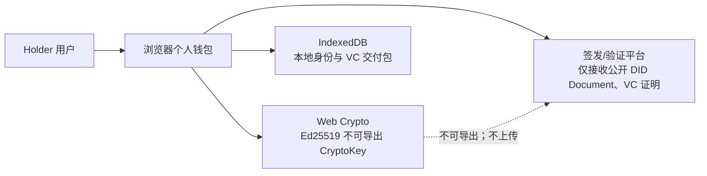
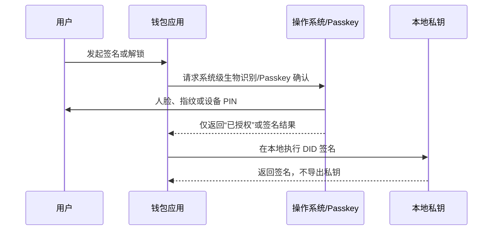

# 个人钱包私钥保护与恢复技术选型对比

> 适用对象：DID/VC 个人 Holder 钱包 MVP。  
> 结论先行：**不向用户展示、复制或导出原始 DID 私钥。** 日常签名使用设备本地不可导出密钥；恢复能力采用“用户控制的加密备份”逐步补齐；生产版优先迁移至原生钱包或浏览器扩展，借助操作系统安全硬件与 Passkey/生物识别进行解锁。

## 1. 问题与安全目标

个人 Holder DID 的私钥代表“谁能以该身份签名”。如果把它交给平台保存，平台就能理论上代替用户签名；如果将它以文本形式交给用户复制，私钥则可能进入截图、剪贴板、网盘、聊天记录或明文笔记。

因此，本项目要同时满足以下目标：

| 目标 | 含义 |
|---|---|
| 用户控制权 | 平台不持有、不能导出、不能代签 Holder 私钥 |
| 日常易用性 | 用户不需要记忆或反复输入长私钥 |
| 抗意外泄露 | 私钥不以文本、JSON、PEM、二维码等形式展示 |
| 设备安全 | 丢失设备或浏览器被清理时，损失范围可控 |
| 可恢复性 | 用户换设备后有可选恢复路径，但平台不能借恢复机制取得明文私钥 |
| 可审计性 | 钱包签名、备份、恢复等高风险操作应有明确提示和证据边界 |

## 2. 当前 MVP 的基线方案

当前个人钱包位于 `wallet/`，是独立于机构管理后台的浏览器本地应用。

当前实现的特点：

- 浏览器 Web Crypto 本地生成 Ed25519 密钥对；
- 私钥以不可导出的 `CryptoKey` 保存到该浏览器配置的 IndexedDB；
- 钱包只能请求私钥完成签名，不能将其导出为文本或 JWK 私钥；
- 平台只登记 Holder DID、DID Document 和公钥；
- 钱包交付包与最小披露证明均不含 Holder 私钥；
- 当前未提供跨设备恢复；清除浏览器数据或更换设备可能导致身份不可用。

### 为什么不应弹窗展示原始私钥

“仅展示一次、用户复制后点击确定”的模式看似强调控制权，实际会扩大泄露面：

1. 复制动作会使私钥进入系统剪贴板；
2. 用户常会截图、存入网盘或即时通信工具；
3. 任何取得该文本的人都可永久冒充 Holder；
4. 用户仍需在每次使用时依赖不安全的保存位置；
5. 不可导出 `CryptoKey` 的保护边界会被主动绕开。

因此，首次创建页面应展示的是**安全告知与恢复选项**，而不是私钥本身。

## 3. 技术选型对比

| 方案 | 私钥/恢复材料位置 | 用户日常体验 | 安全性 | 恢复能力 | 主要风险与限制 | 适用阶段 |
|---|---|---|---|---|---|---|
| 浏览器不可导出密钥 | 浏览器 IndexedDB 的 `CryptoKey` | 无需输入长私钥 | 中等：避免文本泄露 | 无 | 清浏览器数据、设备丢失即可能丢失身份；同源恶意脚本仍可能诱导签名 | 当前 MVP，已实现 |
| 二级密码本地锁 | 本地密钥或其加密包装 | 打开/签名时输密码 | 中等 | 取决于是否有备份 | 密码弱、KDF 不当会遭离线破解；不能把普通密码当作密钥本身 | Web 钱包近期增强 |
| Passkey / WebAuthn 解锁 | 本地密钥仍在设备；Passkey 用于授权或派生包装密钥 | 指纹、人脸、设备 PIN 确认 | 较高 | 取决于 Passkey 同步策略 | WebAuthn 能力、PRF 扩展和浏览器兼容性需要评估 | 推荐的 Web 产品方向 |
| 原生 App 安全区 | iOS Secure Enclave / Android Keystore | 指纹、人脸或系统 PIN 解锁 | 高 | 可结合设备迁移 | 需要移动端开发；跨平台成本高 | 生产级优先方案 |
| 加密备份文件 | 用户持有的加密文件；平台可选存密文 | 平时无感，恢复时输入恢复密码 | 中高 | 有 | 忘记恢复密码则无法恢复；文件被盗后存在离线猜测风险 | 推荐的 MVP 下一阶段 |
| 助记词/恢复短语 | 用户离线抄写或安全保管 | 恢复简单 | 取决于保管方式 | 高 | 容易截图、拍照、云同步；泄露即完全接管 | 不建议默认启用 |
| 端到端加密云备份 | 服务端/云端仅保存密文 | 多设备较方便 | 中高 | 高 | 密码遗失难恢复；需要严谨的密钥派生、版本与同步设计 | 产品化第二阶段 |
| 社交恢复 / 门限分片 | 多位可信联系人或多台设备分别保留份额 | 日常无感，恢复需协作 | 高 | 高 | 联系人失联、串通、门限配置复杂 | 高价值身份场景 |
| 硬件安全钥匙 | USB/NFC 安全钥匙 | 插入或触碰确认 | 很高 | 需备用钥匙 | 购置与携带成本；设备丢失要有备份策略 | 企业、高安全场景 |
| 平台托管私钥 | 平台 KMS/数据库 | 最方便 | 低，不符合自托管 | 高 | 平台可代签，形成高价值攻击目标 | 不推荐作为 Holder 默认方案 |
| MPC/阈值签名 | 用户和服务端各保留份额 | 可接近无感 | 较高 | 设计得当时较高 | 协议、可用性、恢复和合规复杂；服务端仍影响签名可用性 | 长期探索，不纳入课程 MVP |

## 4. “人脸识别”应如何理解

人脸或指纹不应上传到本项目数据库，也不应由网页获取或保存人脸图像。

正确模式是：

也就是说，钱包不“保存人脸”，而是使用系统已经提供的认证器来决定是否允许本地密钥执行签名。

## 5. 推荐演进路线

### 阶段 A：保持当前安全边界（已实现）

- 不展示、不复制、不导出 Holder 原始私钥；
- 使用浏览器 Web Crypto 的不可导出 `CryptoKey`；
- 使用独立个人钱包，不把私钥传入签发/验证平台；
- 在页面明确说明：清理浏览器数据会导致钱包身份丢失。

### 阶段 B：添加钱包解锁与加密备份

1. 增加钱包锁界面：打开钱包或提交签名请求时要求二级密码或 Passkey；
2. 采用强 KDF（优先 Argon2id；Web 环境可在兼容约束下评估 scrypt/PBKDF2）从恢复密码导出包装密钥；
3. 导出加密备份文件，而非私钥明文；
4. 备份文件至少包含版本、加密算法、KDF 参数、随机盐、密文和认证标签；
5. 平台如提供备份同步，只能保存密文，且不得拥有恢复密码；
6. 创建和恢复时显示风险告知，并要求用户确认已理解“平台无法找回恢复密码”。

### 阶段 C：Passkey 与多设备能力

1. 优先接入 WebAuthn/Passkey，使用系统认证器确认高风险签名；
2. 根据浏览器支持情况评估 PRF 扩展，用其派生本地密钥包装材料；
3. 引入端到端加密同步：新设备必须经旧设备批准、恢复密码或满足明确恢复策略；
4. 对新设备加入、备份导出、恢复、DID 轮换记录安全事件。

### 阶段 D：生产级原生钱包

1. 将密钥迁移至 Android Keystore 或 iOS Secure Enclave；
2. 使用指纹、人脸或系统 PIN 解锁；
3. 支持多设备、硬件安全钥匙、社交恢复或门限恢复；
4. 对高价值操作增加交易确认、反钓鱼域名展示和风险检测。

## 6. 本项目的推荐决策

| 决策项 | MVP 决策 | 原因 |
|---|---|---|
| 是否展示私钥 | 否 | 避免把不可导出密钥降级为可复制文本 |
| 是否允许复制私钥 | 否 | 剪贴板和截图是常见泄露路径 |
| 日常签名 | 钱包直接调用本地不可导出 `CryptoKey` | 用户无需记忆长密钥 |
| 初次提示 | 展示私钥归属、丢失边界与备份提示 | 用户理解控制权和责任，不接触原始私钥 |
| 解锁方式 | 后续优先 Passkey；兼容场景可使用二级密码 | 生物特征由系统处理，不上传至平台 |
| 恢复方式 | 后续采用用户恢复密码加密的备份文件 | 平台可存密文但不能解密 |
| 平台数据库 | 不保存 Holder 私钥或可还原明文 | 保持自托管边界 |

## 7. 可用于答辩的表述

> 我们没有采用“弹窗展示一次私钥、用户自行复制保存”的方案，因为这会把密钥暴露到剪贴板、截图和云端笔记中，反而降低安全性。当前 MVP 使用浏览器 Web Crypto 生成不可导出的 Holder 私钥，用户不必记忆它，平台也无法读取它。后续将用 Passkey 或系统级生物识别解锁本地签名，并提供用户恢复密码加密的备份文件；平台最多保存密文，不能恢复或代签用户身份。

## 8. 明确边界

- 当前浏览器钱包不是硬件钱包，也尚未实现跨设备恢复；
- 不可导出不等于绝对安全：需要持续防范 XSS、恶意扩展、设备失陷和钓鱼页面；
- 钱包页面应部署在 HTTPS、独立可信域名下，并配置严格 CSP、依赖审计和最小化第三方脚本；
- 助记词、云备份、社交恢复会提高可恢复性，也会扩大攻击面，必须由用户明确选择，而不应默认开启。
