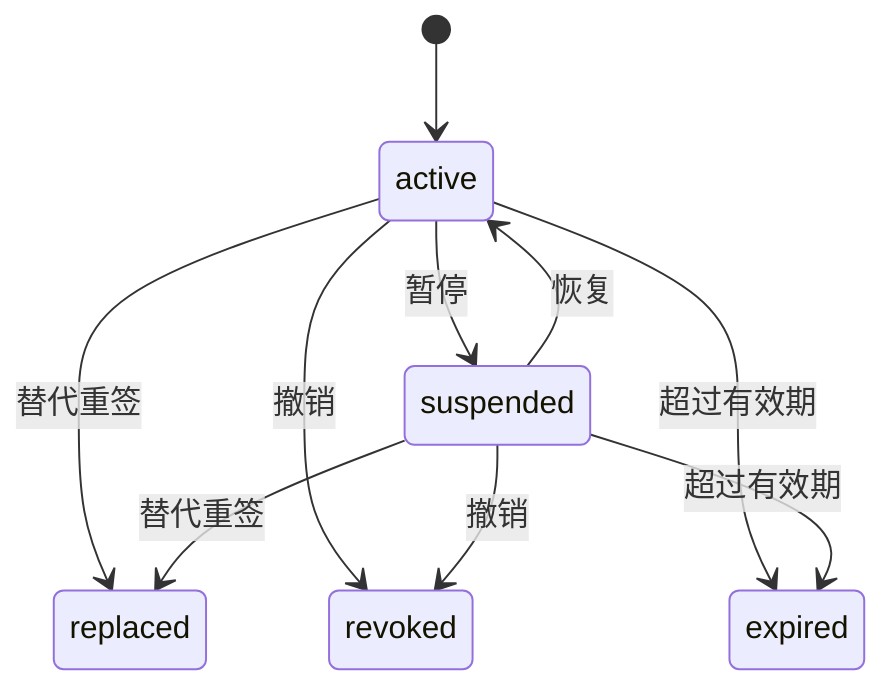
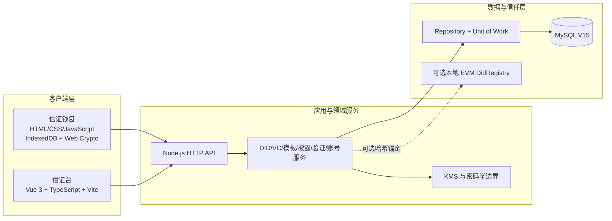
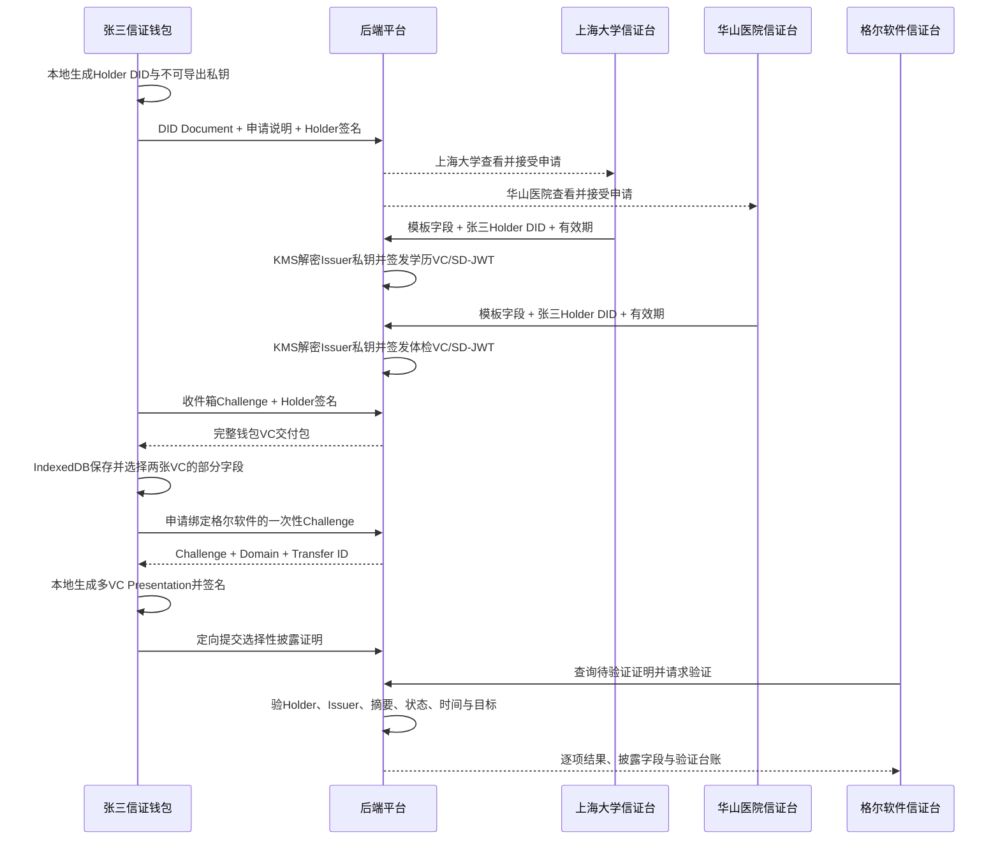
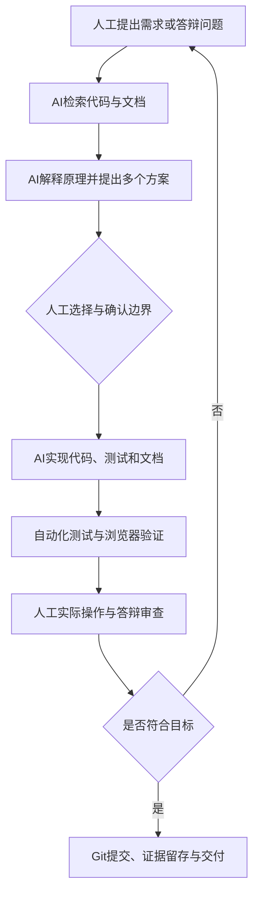

# 信证台与信证钱包：DID/VC 项目结项总结与技术复盘

> 项目性质：DID/VC 课程结业项目、可运行的本地 MVP、软件工程与 AI 辅助开发实践
>
> 最终答辩状态：已完成，现场演示效果良好
>
> 文档基线：以 2026 年 7 月 16 日当前代码、Git 历史、自动化测试和项目文档为准

---

## 摘要

本项目最终形成了两个职责明确的 Web 产品：面向个人 Holder 的“信证钱包”，以及面向组织 Issuer 和 Verifier 的“信证台”。项目以“张三入职”为核心演示场景：上海大学签发本科毕业证明，华山医院签发 A 类体检报告，张三在个人钱包中持有两张凭证，从中选择少量必要字段组成跨凭证的选择性披露证明，再通过模拟“碰一下”或二维码的方式定向发送给格尔软件验证。

系统实现了 DID 创建与解析、DID Document、公私钥控制证明、Ed25519 签名验签、VC 签发与动态生命周期、版本化自定义模板、SD-JWT 核心选择性披露、多 VC 组合出示、Holder 本地签名、防重放 Challenge、验证台账、结构化审计日志、多租户隔离、MySQL 持久化、AES-256-GCM 静态数据加密、独立钱包收件箱，以及可选的本地 EVM DID 哈希锚定。

项目最重要的成果不只是功能数量，而是经过多次答辩反馈后完成了架构纠偏：从“管理中心掌握所有 DID 私钥”转向 Holder 私钥自托管；从管理员默认看到 VC 明文转向默认摘要与受控解密；从个人和组织混合的复杂工作区转向 Holder、Issuer、Verifier 三个清晰角色；从固定字段凭证转向动态模板和多凭证组合披露；从显式复制 Challenge 转向保留密码学检查但简化交互的“碰一下”演示。

当前版本仍是教学与演示用途的 MVP，不应被宣传为已经具备正式跨机构互操作、真实 NFC、生产级移动安全区、正式信任注册机构、完整 SD-JWT VC 互操作或去中心化治理的商业产品。但它已经建立了一条完整、可运行、可验证、可继续演进的数字凭证业务闭环。

---

## 1. 项目背景与问题定义

### 1.1 现实问题

传统入职、准入、培训和资质验证通常依赖纸质证件、复印件、扫描件、Excel 名单和盖章文件。例如一个人入职企业时，可能要提交身份证明、毕业证、学位证、银行卡材料和体检报告。这种方式存在几个长期问题：

1. **重复提交**：同一份材料要反复交给不同机构。
2. **真伪难辨**：图片和复印件可以修改，验证方难以自动确认签发来源。
3. **状态滞后**：文件副本仍在流转，但资格可能已经暂停、过期或撤销。
4. **过度收集**：为了证明一个结论，往往交出了整份材料。
5. **数据割裂**：学校、医院、培训机构和企业分别维护自己的副本。
6. **个人失去控制**：材料一旦交出，个人难以知道后续如何保存和使用。

因此，本项目真正要解决的问题不是“把纸质证件转换成 JSON”，而是：

> 多家机构分别对不同事实签发数字证明，个人如何自行持有、按需组合、最小披露，并让验证方能够检查来源、完整性、有效期和实时状态。

### 1.2 核心场景

最终答辩采用“张三入职格尔软件”的完整场景：

```text
上海大学 ──签发本科毕业证明──┐
                              ├─→ 张三信证钱包 ─→ 组合部分字段 ─→ 格尔软件验证
华山医院 ──签发A类体检报告───┘
```

张三向格尔软件证明：

- 自己已经本科毕业；
- 专业为计算机科学与技术；
- 已完成 A 类体检；
- 综合结论合格；
- 当前适合入职；
- 相关凭证仍在有效期内。

同时，张三可以不披露学号、毕业证书编号、体检报告编号、具体检查明细和服务价格。

### 1.3 项目价值主张

项目最终形成的价值表述是：

> **一次签发、个人持有、按需组合、跨组织验证、状态可查。**

其中，“一次签发”不是指凭证永远有效，而是签发方不必为每个验证方重新制作一份材料；“个人持有”强调 Holder 的钱包和私钥控制；“按需组合”强调多个 VC 和字段级披露；“跨组织验证”强调签发者与验证者不是同一机构；“状态可查”强调签名有效不等于当前仍可接受。

---

## 2. DID 相关技术原理

### 2.1 DID 是什么

DID 是 Decentralized Identifier，即去中心化标识符。它通常写成：

```text
did:<method>:<method-specific-id>
```

例如：

```text
did:example:52bd8aca-342a-4e3c-aa7b-adb348823276
did:key:z6Mkw...
```

DID 本身只是一个标识符，不是私钥，也不等同于某个人的身份证号码。它需要通过对应的 DID Method 解析出 DID Document，才能得到公钥、验证方法、控制者和服务信息。

DID 主要解决的是：

1. 使用什么稳定标识代表一个主体；
2. 如何找到该主体声明的公钥；
3. 如何验证某个操作确实由对应私钥控制者发起；
4. DID 是否仍然有效，以及公钥是否发生过轮换。

### 2.2 DID Document

DID Document 是 DID 的公开解析结果，典型结构包括：

```json
{
  "id": "did:key:z6Mk...",
  "verificationMethod": [
    {
      "id": "did:key:z6Mk...#key-1",
      "type": "JsonWebKey2020",
      "controller": "did:key:z6Mk...",
      "publicKeyJwk": {
        "kty": "OKP",
        "crv": "Ed25519",
        "x": "公开公钥"
      }
    }
  ],
  "authentication": ["did:key:z6Mk...#key-1"],
  "assertionMethod": ["did:key:z6Mk...#key-1"]
}
```

其中：

- `id`：DID 本身；
- `verificationMethod`：可用的公钥验证方法；
- `controller`：谁控制该验证方法；
- `publicKeyJwk`：公开公钥；
- `authentication`：可用于身份认证的验证方法；
- `assertionMethod`：可用于签发声明或凭证的验证方法。

DID Document 本来就是公开验证材料，不应把“前端能看到 DID Document 明文”误判为私钥泄露。真正需要保护的是私钥、凭证中的敏感声明以及受控访问数据。

### 2.3 DID 如何证明“是谁”

DID 并不会自动证明现实身份。它首先证明的是“某个主体控制对应私钥”。基本过程如下：

1. 主体生成公私钥对；
2. 公钥进入 DID Document；
3. 主体使用私钥对 Challenge 或业务数据签名；
4. 验证方解析 DID Document，取得公钥；
5. 验证方使用公钥验签；
6. 验签通过，说明出示者控制对应私钥。

如果还要证明“这个 DID 现实中属于上海大学”，则需要额外的信任来源，例如教育主管部门、CA、行业信任名单、联盟链治理或经过审核的注册表。密码学控制权与现实法律身份是两个层次，不能混为一谈。

### 2.4 本项目的 `did:example`

`did:example` 是项目内部实现的教学型 DID Method，用于演示动态生命周期。它支持：

- 创建；
- 解析；
- 更新名称和服务地址；
- 密钥轮换；
- 停用；
- 历史公钥解析。

它的 Method Specific Identifier 使用 UUID，例如：

```text
did:example:<uuid>
```

`did:example` 的 DID 不由公钥直接决定，因此更换公钥时可以保持 DID 不变。系统通过版本号、当前验证方法和历史公钥记录完成密钥轮换后的历史 VC 验证。

本项目选择自己实现 `did:example`，不是为了声称它比市场标准更强，而是为了在课程环境中完整演示更新、轮换和停用，并掌握 DID Method 的适配、解析和生命周期设计。它不是一个已经获得外部生态支持的正式公共 DID Method。

### 2.5 本项目的 `did:key`

`did:key` 根据公钥派生 DID。项目使用 Ed25519 公钥，加上 multicodec 前缀，再进行 base58btc 编码，形成类似：

```text
did:key:z6Mk...
```

它具有自认证特点：DID 字符串本身携带了推导公钥所需的信息，不依赖中心注册表即可恢复公钥。

但也正因为 DID 由公钥派生，公钥改变时 DID 也会改变，所以当前项目明确将 `did:key` 视为不可更新、不可在同一 DID 下轮换、不可由本地注册表赋予正式停用语义的 Method。

最终架构中：

- 组织 Issuer 使用可管理生命周期的 `did:example`；
- 个人 Holder 钱包使用本地生成的 `did:key`；
- Holder 私钥仅保存在钱包本地。

### 2.6 DID、Issuer、Holder 与 Verifier 的关系

- **Issuer**：签发 VC 的主体，例如上海大学、华山医院；
- **Holder**：持有并出示 VC 的主体，例如张三；
- **Verifier**：验证 VC 或 Presentation 的主体，例如格尔软件。

一个 VC 中通常通过以下字段区分：

```json
{
  "issuer": "上海大学的Issuer DID",
  "credentialSubject": {
    "id": "张三的Holder DID"
  }
}
```

Issuer 使用自己的私钥签发，Holder 使用自己的私钥证明当前出示行为由自己控制，Verifier 使用公开 DID Document 中的公钥完成验签。

---

## 3. VC、签名与完整验证原理

### 3.1 VC 是什么

VC 是 Verifiable Credential，即可验证凭证。它是一个由 Issuer 对特定主体和事实进行数字签名的数据对象。

本项目中的 VC 结构接近 W3C VC Data Model 2.0 的核心表达：

```json
{
  "@context": ["https://www.w3.org/ns/credentials/v2"],
  "id": "urn:uuid:...",
  "type": ["VerifiableCredential", "UniversityGraduationCredential"],
  "issuer": "did:example:school-id",
  "validFrom": "2026-06-30T00:00:00.000Z",
  "validUntil": "2036-06-30T23:59:00.000Z",
  "credentialSubject": {
    "id": "did:key:zhangsan",
    "subjectName": "张三",
    "degreeLevel": "本科",
    "major": "计算机科学与技术"
  },
  "proof": {
    "type": "EducationalEd25519Signature2026",
    "verificationMethod": "did:example:school-id#key-1",
    "keyVersion": 1,
    "proofPurpose": "assertionMethod",
    "proofValue": "签名值"
  }
}
```

其中 `EducationalEd25519Signature2026` 是本项目的教学命名，用来明确区分正式注册的 W3C Data Integrity Cryptosuite。

### 3.2 Ed25519 是什么

Ed25519 是一种基于 Edwards 曲线的数字签名算法。它在本项目中用于：

- Issuer 对 VC 签名；
- Issuer 对选择性披露摘要或 SD-JWT 签名；
- Holder 对 DID 登记包签名；
- Holder 对收件箱 Challenge 签名；
- Holder 对多 VC 组合 Presentation 签名。

签名和验签可以抽象为：

```text
signature = Sign(privateKey, message)
valid = Verify(publicKey, message, signature)
```

私钥负责生成签名，公钥只能验证，不能由公钥反推出私钥。

必须强调：**Ed25519 是签名算法，不是加密算法。** 它保证来源真实性、完整性和一定程度的不可否认性，但不会把 JSON 变成只有接收方才能阅读的密文。

### 3.3 稳定序列化

JSON 对象的键顺序可能不同，但签名必须对应确定的字节序列。因此项目在签名前使用稳定键序序列化：对象键按固定顺序处理，数组保持原有顺序，再对得到的字节签名。

如果签发后修改 `credentialSubject`、有效期、Issuer 或 proof 相关数据，重新序列化的消息就会发生变化，原签名验签失败。

### 3.4 签名有效不等于凭证当前有效

这是项目最重要的知识点之一。签名有效只能证明：

- 对应私钥曾经对这份内容签名；
- 被签名内容没有发生变化。

但完整验证还必须检查：

| 检查项 | 目的 |
|---|---|
| 格式 | 必要字段和结构是否合法 |
| Issuer DID | 签发方 DID 是否存在且可解析 |
| DID 状态 | Issuer 是否已经停用 |
| 密钥版本 | proof 指定的历史或当前公钥是否存在 |
| 签名 | 内容是否被篡改，是否由对应私钥签发 |
| 有效期 | 是否尚未生效或已经过期 |
| VC 状态 | 是否暂停、替代或撤销 |
| Holder 绑定 | 当前出示者是否控制 Holder DID 私钥 |
| Challenge/Domain | 是否为本次验证和目标组织生成，是否存在重放 |
| 信任政策 | Issuer 是否在验证方认可的名单中，是否有资格签发该类凭证 |

因此，一个被撤销的 VC 可能仍然 `signature=true`，但 `credentialStatus=false`，最终 `valid=false`。

### 3.5 VC 动态生命周期

项目实现的 VC 状态机为：



动态生命周期的意义是把“内容真实性”和“当前是否仍可接受”分离。每次吊销后重新签发并不能消除旧副本继续流转的问题；验证方仍需知道旧凭证是否失效。暂停适合临时冻结，恢复不会重新制作凭证；替代重签保留新旧关系；撤销是不可逆终态；过期由时间计算。

---

## 4. 选择性披露与 SD-JWT 原理

### 4.1 为什么需要选择性披露

如果张三为了证明“体检合格”必须交出完整体检报告，系统仍然延续了传统材料的过度收集问题。选择性披露的目标是：

> 只交出当前验证所需的字段，同时让验证方确认这些字段确实来自原始凭证且没有被修改。

### 4.2 随机盐的作用

如果直接对低熵值计算哈希，例如：

```text
SHA-256("本科")
```

攻击者可以预先计算“本科、硕士、博士”等常见值的哈希并进行字典猜测。

因此，披露项加入随机盐：

```text
disclosure = Base64URL([salt, claimName, claimValue])
digest = SHA-256(disclosure)
```

同一个字段值因为盐不同会产生不同摘要，降低未披露值被字典枚举的风险。

### 4.3 SD-JWT 的结构

SD-JWT 中的 `SD` 是 Selective Disclosure，即选择性披露。核心结构为：

```text
Issuer-signed JWT ~ Disclosure 1 ~ Disclosure 2 ~
```

Issuer-signed JWT 的载荷包含：

- `iss`：Issuer DID；
- `sub`：Holder DID；
- `jti`：凭证 ID；
- `iat`、`nbf`、`exp`：时间；
- `vct`：凭证类型；
- `_sd_alg`：摘要算法；
- `_sd`：所有可披露字段摘要。

每个 Disclosure 是一个 Base64URL 编码数组：

```json
["随机盐", "字段名", "字段值"]
```

Holder 出示时只附带选中的 Disclosure。验证方解码 Disclosure，重新计算 SHA-256，并检查结果是否存在于 Issuer 已签名的 `_sd` 中。

### 4.4 多 VC 组合披露

项目进一步实现了多凭证组合出示。钱包可以从多张本地 VC 中选择字段，例如：

```text
上海大学 VC：姓名、学历层次、专业、毕业状态
华山医院 VC：体检类别、综合结论、适岗结论、有效期
```

钱包生成：

```json
{
  "type": "WalletBoundMultiSdJwtPresentation2026",
  "holderDid": "张三Holder DID",
  "verifiableCredentials": [
    { "format": "vc+sd-jwt", "sdJwt": "学校JWT~选中披露~" },
    { "format": "vc+sd-jwt", "sdJwt": "医院JWT~选中披露~" }
  ],
  "challenge": "一次性随机数",
  "domain": "格尔软件标识",
  "holderProof": { "proofValue": "张三Holder签名" }
}
```

Holder 对整个组合、Challenge 和 Domain 签名，使验证方可以确认：

- 两张凭证属于同一个 Holder DID；
- 当前出示者控制 Holder 私钥；
- 证明是为本次验证和格尔软件生成；
- 凭证组合未在传输过程中被替换。

### 4.5 当前选择性披露的边界

本项目的选择性披露不能等同于完整零知识证明：

- 被选字段仍以可解码形式交给验证方；
- 验证方能看到 Holder DID，因此多次出示可能关联；
- 当前未实现完全匿名或不可关联出示；
- 未实现 BBS+ 的派生证明；
- Holder 组合签名是课程 MVP 的绑定方式，不是完整正式 SD-JWT Key Binding 互操作实现；
- Base64URL 只是编码，不是加密。

BBS+ 可以支持从一个签名凭证中派生只含部分声明的证明，并具备更强的零知识和不可关联能力，但需要成熟的第三方密码学库、规范兼容、密钥格式、证明套件和互操作测试。项目最终选择 SD-JWT 核心路线，是在工期、可解释性和工程风险之间做出的合理折中。

---

## 5. 密码学与数据安全设计

### 5.1 密码哈希、加密、签名与编码的区别

| 技术 | 本项目用途 | 是否可逆 | 主要目标 |
|---|---|---:|---|
| scrypt + 随机盐 | 账号密码保存 | 否 | 防止数据库泄露后直接得到密码 |
| AES-256-GCM | 私钥、VC、披露材料、验证证据静态加密 | 是，需密钥 | 机密性、完整性和密文篡改检测 |
| Ed25519 | VC、登记包、Challenge、Presentation 签名 | 签名不可“解密” | 来源真实性和内容完整性 |
| SHA-256 | 披露摘要、Challenge 哈希、链上锚定哈希 | 否 | 固定长度摘要与变更检测 |
| Base64URL | JWT、签名和 Disclosure 的文本表示 | 可解码 | 安全地放入 URL/JSON，不提供保密性 |
| HTTPS/TLS | 生产网络传输 | 会话内可解密 | 防窃听、中间人和链路篡改 |

### 5.2 Issuer 私钥保护

组织 Issuer 的私钥由机构侧 KMS 边界使用：

1. 私钥 JWK 使用 AES-256-GCM 加密后存入 MySQL；
2. 密文包含随机 IV、认证标签和记录绑定的附加数据；
3. 签发时由 KMS 服务在内部解密并执行签名；
4. 普通 API、列表页面和日志不返回私钥；
5. 相同明文因随机 IV 不会产生相同密文；
6. 密文被篡改或移动到其他记录时认证失败。

当前是本地事务型 KMS，不是独立硬件 HSM。生产环境应替换为外部 KMS/HSM，并建立密钥轮换、授权审批、审计和灾难恢复流程。

### 5.3 Holder 私钥自托管

项目早期曾把 Holder 和 Issuer 都放在管理中心，这在身份自主控制上存在根本问题。答辩反馈指出 Holder 私钥应掌握在个人手中，随后项目完成了钱包重构：

- 钱包通过 Web Crypto 在浏览器本地生成 Ed25519 密钥对；
- `extractable=false`，私钥不能通过普通 JavaScript 导出；
- 私钥以 `CryptoKey` 保存到 IndexedDB；
- 平台只登记 DID Document 和公钥；
- 钱包使用本地私钥签名登记申请、领取 Challenge 和 Presentation；
- Holder 私钥不进入信证台后端和 MySQL。

这一方案比服务端集中保存 Holder 私钥更符合自托管思想，但浏览器钱包仍然不是最终生产形态。更安全的方向是原生移动 App、iOS Secure Enclave、Android Keystore、Passkey/硬件安全模块、生物识别解锁，以及经过设计的加密备份和恢复机制。

### 5.4 静态加密与传输加密

项目使用 AES-256-GCM 保护 MySQL 中的敏感静态数据，包括：

- Issuer 私钥材料；
- 完整 VC 正文；
- SD-JWT 披露盐和材料；
- 钱包待领取交付包；
- 待验证 Presentation；
- 完整验证证据和审计载荷。

但本地演示使用 HTTP。服务端授权解密后返回给浏览器的数据，在本地网络传输层没有 TLS 保护。因此，AES 静态加密不能替代 HTTPS。生产部署必须使用 HTTPS/TLS，并可进一步考虑为指定 Verifier 使用 X25519 等独立 `keyAgreement` 密钥做应用层端到端加密。

### 5.5 管理员能否看到 VC 明文

项目曾存在管理员刷新列表即可批量看到凭证明文的问题。生产安全整改后：

- 普通列表只返回签发组织、持有人、模板、状态、时间等摘要；
- 列表查询不选择、不解密完整密文；
- 读取敏感正文需要独立角色和明确 purpose；
- 读取前必须写入敏感访问审计；
- 审计写入失败则敏感读取失败关闭；
- `tenant_admin` 不再自动继承所有 Issuer、Verifier 和敏感读取能力。

这体现了职责分离、最小权限、默认不解密和可追责访问的原则。

---

## 6. 最终产品与系统架构

### 6.1 两个产品、三个角色

| 产品 | 服务角色 | 主要功能 |
|---|---|---|
| 信证钱包 | Holder | 注册登录、创建多个 DID、私钥本地保存、向组织发送 DID、领取 VC、本地凭证库、选择性披露、碰一碰/二维码出示 |
| 信证台 | Issuer | 组织注册登录、创建机构 DID、自定义模板、签发 VC、生命周期管理、签发日志 |
| 信证台 | Verifier | 接收定向 Presentation、逐项验证、查看披露字段和验证台账 |

最终答辩整改后，Holder 不再登录信证台；Issuer 和 Verifier 不进入个人钱包；一个信证台账号只绑定一个组织，不再提供个人空间、组织切换和跨组织成员关系。

### 6.2 总体架构



### 6.3 前后端分离

信证台已经采用 Vue 3、TypeScript 和 Vite 独立工程，通过 API Client 调用后端。生产思路是由独立 Web 层提供前端静态资源和 HTTPS，同源反向代理 `/api` 到 Node 后端。

信证钱包当前仍是独立的 HTML/CSS/JavaScript 应用，但同样通过 HTTP API 与后端交互，并把 Holder 私钥与 VC 包保存在浏览器 IndexedDB。它与信证台在产品入口、账号体系和本地数据上相互分离。

### 6.4 后端分层

当前后端主要分为：

1. **API 层**：解析路由、认证请求、返回统一错误；
2. **访问控制层**：校验角色、租户和敏感读取权限；
3. **领域服务层**：DID、VC、模板、披露、验证、钱包收件箱、NFC 模拟；
4. **Repository 层**：封装 SQL、租户过滤、加密字段和对象映射；
5. **Unit of Work**：在同一事务中完成多表操作和回滚；
6. **KMS/密码学层**：私钥解密、签名、验签、摘要和信封加密；
7. **MySQL 数据层**：保存组织、账号、会话、DID、密钥版本、VC、状态事件、模板、披露材料和台账。

这种分层使业务服务不直接拼接 SQL，也使后续替换数据库、KMS 或公开注册表时更容易控制影响范围。

### 6.5 MySQL V15 数据演进

项目从早期 JSON 文件逐步迁移到 MySQL，共形成 15 个顺序迁移版本，主要覆盖：

- 初始业务表；
- Repository 与生产数据层；
- V2 VC 与状态事件；
- 审计日志；
- 敏感访问控制；
- 自托管 Holder DID；
- Verifier Challenge 台账；
- 钱包凭证收件箱；
- 多租户身份；
- Holder DID 公共目录；
- 动态凭证与公共信任投影；
- 角色边界与 NFC 投递；
- 钱包账号；
- Holder 到组织的申请；
- 定向 Presentation 传输。

迁移框架只执行尚未记录的版本，并通过 `schema_migrations` 管理数据库版本。

### 6.6 多租户实现

多租户不是简单在界面上切换组织，而是在数据库和请求上下文中隔离组织数据：

- 登录令牌携带 `tenant_id`、用户、会话和凭据版本；
- Repository 查询必须取得租户上下文；
- 组织数据表以 `tenant_id` 过滤；
- Issuer 只能访问和管理本组织的 DID、模板与 VC；
- Verifier 只能验证定向发送给当前组织的 Presentation；
- 敏感访问日志同时绑定租户和操作者。

最终 MVP 删除了复杂的跨组织成员和空间切换，但保留 `tenant_id` 作为组织隔离边界。

---

## 7. 张三入职场景完整业务流程



该流程中的重要数据边界是：

- Holder 私钥始终不离开钱包；
- Issuer 私钥始终不通过普通 API 返回；
- 钱包领取时获得完整 VC，因为 Holder 需要自行持有；
- 最终 Presentation 只包含选中的 Disclosure，不包含未选字段原值；
- 二维码只包含随机传输 ID 和过期时间，不直接包含完整 VC；
- 验证方首先只收到待验证摘要，点击验证后由后端执行完整检查。

---

## 8. 动态模板与多凭证能力

### 8.1 从固定字段到动态模板

早期系统只有“姓名、课程、完成日期”等固定字段，不适合真实多行业场景。最终系统允许组织创建版本化模板，定义：

- 模板名称；
- 凭证类型；
- 字段 key；
- 中文标签；
- 文本、数字、日期、布尔、枚举等类型；
- 是否必填；
- 枚举选项。

模板先创建为草稿，发布后用于签发，退役后不能继续签发；已经签发的 VC 仍保留模板 ID、版本和 schema hash，便于验证历史凭证。

### 8.2 动态模板的意义

上海大学可以定义学历证明，华山医院可以定义 A/B 类体检报告，培训机构可以定义结业证书，行业协会可以定义职业资格。新增业务主要通过配置模板完成，而不是修改后端代码和数据库表结构。

### 8.3 多 VC 组合的意义

真实业务通常不是“一张证书解决全部条件”，而是：

```text
学历证明 + 体检证明 + 培训证明 + 项目授权
```

项目允许钱包从多个 Issuer 的多张 VC 中选择任意字段，形成一次 Holder 绑定的组合 Presentation。验证方逐张验证 Issuer 签名和状态，再按整体业务规则判断是否满足准入条件。

---

## 9. 账号、认证、权限与审计

### 9.1 两套账号体系

- 信证台账号：组织负责人或组织操作员；
- 信证钱包账号：个人 Holder；
- 两套入口和会话相互独立；
- 钱包账号不等于 Holder 私钥，登录主要用于区分钱包数据范围；
- 当前“平台代托管”只是 MVP 选项记录，不代表已完成生产密钥托管。

### 9.2 密码与会话

- 密码使用 scrypt 和随机盐保存；
- 登录成功后使用带有效期的访问令牌；
- 令牌绑定用户、租户、可撤销会话和凭据版本；
- 会话撤销、过期或凭据版本变化后失效；
- 生产配置禁止使用本地开发登录模式。

### 9.3 RBAC 与职责分离

角色包括组织管理员、Issuer 操作员、Verifier 操作员、敏感数据读取者等。管理员不自动继承所有能力。签发、验证、读取明文和审计管理使用不同权限，避免“一个管理员天然看到和操作一切”。

### 9.4 结构化日志与证据链

项目建立了审计日志、系统日志、敏感访问日志和验证台账：

- 每个请求有 `correlationId`；
- 记录模块、动作、结果、时间、租户和操作者；
- 成功、业务拒绝和系统错误使用 INFO/WARN/ERROR；
- 写入前递归脱敏 token、password、private key、proof 和完整 VC；
- 验证台账记录验证时间、Holder DID、凭证数量、逐张结果和披露路径；
- 敏感正文读取必须先写审计，审计失败则不返回明文。

---

## 10. 可选区块链能力与信任来源

### 10.1 当前区块链实现

项目提供可选的本地 EVM `DidRegistry` 演示，使用 Ganache、Solidity、ethers 和 solc。链上只保存：

- DID 哈希；
- DID Document 哈希；
- 版本；
- 控制账户；
- 停用状态。

链上不保存 Holder 私钥、VC 明文或个人信息。该功能用于演示公开 DID 状态如何从单一数据库扩展到多方可共同校验的注册表，但最终答辩主流程没有依赖区块链，以避免本地节点和部署环境影响核心业务演示。

### 10.2 DID 是否必须依赖区块链

DID 不一定必须使用区块链。`did:web` 可以依赖域名和 HTTPS，`did:key` 可以从公钥自解析，其他 Method 可以使用联盟链、公共链、分布式数据库或受治理注册表。

但如果所有 DID、公钥和状态都由一个平台数据库单方面控制，那么跨机构场景仍然需要信任该平台。区块链或多方可信注册表真正提供的价值不是“让 JSON 上链”，而是降低单一机构静默修改信任数据的能力。

### 10.3 未来生产信任链

```text
教育主管部门 / CA
        ↓ 审核上海大学Issuer DID
卫生主管部门 / CA
        ↓ 审核华山医院Issuer DID
联盟链或多方可信注册表
        ↓ 登记Issuer DID、公钥版本、轮换与停用状态
上海大学、华山医院
        ↓ 使用机构私钥签发VC / SD-JWT
张三个人钱包
        ↓ 本地掌握Holder私钥并持有VC
格尔软件
        ↓ 验证信任名单、DID、Issuer签名、Holder签名、
          VC状态、有效期、披露摘要和企业准入规则
```

信任分工是：

- 主管部门或 CA 回答“它是否真是这家机构”；
- 多方注册表回答“公钥和状态是否能被单方篡改”；
- DID/VC 回答“谁对什么事实进行了签名”；
- 钱包回答“谁持有凭证并控制本次出示”；
- 验证方业务规则回答“这些事实是否足以完成准入”。

---

## 11. 软件工程方法与项目开发过程

### 11.1 需求分析

项目最初从培训结业凭证出发，识别 Issuer、Holder、Verifier，定义 DID 创建、VC 签发、验证、篡改检测和撤销等基本需求。随后逐步补充：

- DID 双 Method 与生命周期差异；
- VC 暂停、恢复、替代、过期、撤销；
- 搜索、分页和操作台账；
- 日志与安全脱敏；
- 选择性披露与 SD-JWT；
- MySQL、认证授权和多租户；
- 自托管 Holder 钱包；
- 动态模板、多 VC 组合与定向验证；
- 答辩演示所需的交互简化。

需求不是一次生成后保持不变，而是在用户体验、测试结果和答辩反馈中不断被修正。

### 11.2 总体设计

项目经历了以下总体架构阶段：

1. 单机 JSON 存储和统一管理页面；
2. DID/VC 领域服务、日志与自动化测试；
3. MySQL Repository、Unit of Work 和应用层加密；
4. V2 认证、RBAC 与租户隔离；
5. Vue3 信证台和独立信证钱包；
6. Holder 私钥自托管、钱包收件箱和本地凭证库；
7. 动态模板、多 VC 组合披露和验证台账；
8. 角色简化、定向“碰一下”和二维码模拟；
9. 可选链上 DID 哈希锚定与生产信任路线。

### 11.3 详细设计

详细设计包括：

- DID Method 适配器与能力声明；
- DID 和 VC 状态机；
- 历史密钥版本；
- 凭证模板 schema 与枚举校验；
- 加盐摘要与 SD-JWT 数据结构；
- Holder 登记包和 Presentation 签名结构；
- Challenge 哈希保存与原子消费；
- Repository 接口、事务边界和乐观锁；
- 数据库迁移和兼容检查；
- RBAC、租户上下文和敏感访问目的；
- 结构化日志、脱敏规则和证据留存。

### 11.4 编码实现

主要技术栈：

| 层次 | 技术 |
|---|---|
| 后端 | Node.js 20+、ECMAScript Modules、原生 HTTP 服务 |
| 组织前端 | Vue 3、TypeScript、Vite、Pinia、Vue Router |
| 个人钱包 | HTML、CSS、JavaScript、Web Crypto、IndexedDB |
| 数据库 | MySQL 8、mysql2、版本化迁移 |
| 密码学 | Node Crypto、Web Crypto、Ed25519、AES-256-GCM、SHA-256、scrypt |
| 选择性披露 | SD-JWT 核心结构、随机盐、Base64URL |
| 测试 | Node Test Runner、Vitest、Playwright |
| 区块链实验 | Solidity、Ganache、ethers、solc |
| 图表与汇报 | Mermaid、下滑式 HTML 演示页、Markdown 文档 |

### 11.5 BDD、SDD 与 TDD 的关系

本项目不是纯粹单一方法，而是三者结合：

- **BDD 倾向**：以“创建身份—签发—领取—披露—验证”和“张三入职”等用户行为场景组织需求与 E2E 测试；
- **SDD 倾向**：先形成产品需求、架构设计、状态机、API 契约、数据模型和任务计划，再实施代码；
- **TDD/回归驱动**：对 Base58、并发写入、生命周期、数据泄露、协议加固等问题先保留失败用例，再修复并全量回归。

更准确的表述是：

> 老师上课说过 BDD、SDD、TDD，我们从这个角度反向思考项目：整体以场景和需求驱动，关键架构采用设计先行，核心规则和缺陷修复使用测试与回归驱动。

---

## 12. 关键演进与答辩整改复盘

### 12.1 从中心管理 Holder 私钥到个人自托管

**问题**：早期系统把 Issuer 和 Holder 的 DID 私钥都放在管理中心，管理员事实上可以代替个人签名。

**整改**：建立独立信证钱包，Holder 使用 Web Crypto 本地生成不可导出的 `CryptoKey`；平台只登记公钥 DID Document；领取和出示均需 Holder 本地签名。

**学到的内容**：数据库加密只能保护平台保存的数据，不能等同于用户自主控制。身份自主的核心是“谁能调用私钥完成签名”。

### 12.2 从“所有 JSON 明文可见”到明确安全边界

**问题**：DID Document、VC、proof 和数据库密文概念混淆，页面上能看到 JSON 就被认为“没有安全”。

**整改**：区分公开 DID Document、主动披露字段、服务端受控 VC 明文和必须保密的私钥；引入 AES-GCM 静态加密、默认摘要列表、敏感访问审计和生产 TLS 要求。

**学到的内容**：安全不是“所有数据都变成密文”。公开公钥必须可读，主动披露字段必须可读；安全目标应分别定义机密性、完整性、真实性、可用性和可审计性。

### 12.3 从固定三字段到动态模板

**问题**：固定的姓名、课程和完成日期无法支持学校、医院、企业等多样业务。

**整改**：实现版本化动态模板、类型校验、枚举选项、发布/退役/删除管理和 schema hash。

**学到的内容**：生产系统应围绕稳定业务抽象设计，而不是把演示样例直接写死成数据模型。

### 12.4 从单 VC 披露到多 VC 组合

**问题**：一个真实准入条件往往来自多个组织，单张 VC 无法表达完整业务。

**整改**：钱包通过可搜索下拉框添加多张凭证，逐张选择字段，再使用 Holder 私钥绑定整个 Presentation；验证方逐张验签并输出组合结果。

**学到的内容**：DID/VC 的价值不只是数字化单张证件，而是多来源事实的可组合信任。

### 12.5 从复杂多空间到三个清晰角色

**问题**：统一注册、个人空间、组织空间、组织切换、跨组织成员等设计过度复杂，不适合 MVP，也模糊了 Holder 与组织的职责。

**整改**：Holder 只使用钱包；Issuer 和 Verifier 只使用信证台；一个组织账号只绑定一个组织；租户 ID 仅用于数据隔离。

**学到的内容**：生产想象不能无限加入 MVP。好的 MVP 不是功能最少，而是角色、边界和核心价值最清楚。

### 12.6 从显式 Challenge 到交互隐藏

**问题**：要求演示者手工复制 Challenge、Domain 和证明 JSON，虽然技术完整，但观众难以理解，演示流程不流畅。

**整改**：后台仍生成高熵一次性 Challenge、保存哈希、绑定目标组织并原子消费，但界面改成“碰一下，就验证！”和二维码。

**学到的内容**：安全机制可以保留在后台，用户体验不必暴露所有协议细节。简化交互不等于删除安全检查。

### 12.7 从代码通过到证据可验证

**问题**：只说“AI 已经测试通过”缺乏可信度，测试记录可能与当前代码不一致。

**整改**：建立单元、集成、API、功能、安全、UI 分层测试；保存本地批次、环境信息、Git 状态、原始日志、报告和 SHA-256 校验清单。

**学到的内容**：测试结论需要时间、代码版本、环境和原始证据；人工验收仍不可替代。

---

## 13. 自动化测试与质量保证

### 13.1 测试分层

| 层级 | 主要内容 |
|---|---|
| 单元测试 | 密码学、DID Method、模板校验、查询、密码哈希、令牌、钱包核心逻辑 |
| 集成测试 | Repository、Unit of Work、KMS、MySQL、DID/VC/披露服务协作 |
| API 测试 | HTTP 契约、认证授权、生命周期、错误码、分页和安全头 |
| 功能测试 | 四种 Method 组合、完整生命周期、钱包流程和多 VC 旅程 |
| 安全测试 | 私钥泄露、日志脱敏、XSS、原型污染、路径穿越、Content-Type、TLS 防护 |
| 前端组件测试 | Vue API Client、凭证表格等组件行为 |
| UI/E2E 测试 | Chromium 中真实点击、表单、签发、领取、披露、验证和响应式布局 |

### 13.2 当前重新验证结果

2026 年 7 月 16 日在当前工作区重新执行：

```text
npm test
结果：243 tests，243 passed，0 failed，0 skipped，0 todo

npm run frontend:test
结果：2 test files，2 tests passed

npm run frontend:build
结果：TypeScript 类型检查通过，Vite 构建成功
```

这说明当前 Node 核心测试、Vue 单元测试和前端构建均通过。该结果不包含本轮重新执行完整 Playwright UI 矩阵、公开互联网安全测试、性能压测、移动端原生安全测试或第三方规范互操作测试。

### 13.3 测试发现的典型缺陷

- Base58 前导零编码错误；
- 并发“读取—修改—写入”导致丢失更新；
- 非 JSON 请求没有被严格拒绝；
- 页面在窄屏下溢出；
- 隐藏单选框继承全宽样式；
- 日志和接口可能暴露 proof、token 或路径；
- 已暂停 VC 仍可生成披露证明；
- Presentation 可能被错误组织接收；
- 固定字段和不可读 UUID 影响真实操作；
- 模板枚举创建和状态管理存在交互问题。

这些问题被保留为回归用例，避免修复后再次出现。

---

## 14. AI 辅助开发与人工协作总结

### 14.1 AI 在项目中的角色

AI 不只是生成代码，还参与了：

- 需求澄清和角色建模；
- DID Method、SD-JWT、BBS+、区块链和钱包方案比较；
- 架构与数据库重构设计；
- 代码实现、缺陷定位和回归测试；
- 安全审查和误区纠正；
- Mermaid 图、演示手册、演讲稿和答辩问答；
- Git 历史、测试证据和项目总结整理。

### 14.2 人工在项目中的角色

人工始终负责：

- 确定课程目标和演示价值；
- 选择采纳或放弃技术方案；
- 决定 MVP 范围与优先级；
- 提供答辩老师反馈；
- 从用户视角发现交互和架构问题；
- 执行真实演示和最终验收；
- 对 AI 生成的文档、代码和表述进行修正。

### 14.3 典型 AI—人工闭环



### 14.4 AI 使用中的经验

1. 不能只说“帮我做一个 DID 系统”，需要给出角色、场景和验收结果。
2. 让 AI 先解释方案和风险，再授权执行，可以减少错误架构。
3. AI 写完代码后必须运行测试、检查页面和核对实际数据流。
4. 对安全概念要反复追问，例如签名是否等于加密、DID 是否等于现实身份、区块链是否必需。
5. 答辩老师提出的问题往往比测试更接近产品根本，应转化为架构整改而不是只修改口径。
6. AI 生成的“生产级”表述需要人工降级校正，避免把教学实现宣传为正式标准实现。
7. 文档、图表和演示页面必须与最新代码同步，否则容易在答辩中自相矛盾。

### 14.5 本次结项整理记录

**时间**：2026-07-16（Asia/Shanghai）  
**Agent**：Codex  
**模型**：GPT-5 系列  
**对话窗口**：当前项目协作任务

**目的推测**：在最终答辩完成后，将分散在代码、Git 提交、设计文档、演示手册和长期问答中的知识统一沉淀为正式结项材料。

**用户提问原文**：

> “本项目最终答辩完成！效果良好！接下来帮我进行整个项目的总结，首先我们用到的 DID 相关技术原理，还要有我们的项目完整正规介绍，开发过程中所学所用到的东西、总结，最终形成一份完整大文档。”

**AI 回答与行为摘要**：

- 检查当前代码结构、依赖、README、数据库迁移和主要设计文档；
- 读取 Git 历史，梳理项目从初始 MVP 到最终架构的演进；
- 重新执行 Node、Vue 测试和前端构建；
- 明确教学实现与生产级标准之间的边界；
- 生成本结项总结与技术复盘文档。

---

## 15. 开发过程中掌握的知识与能力

### 15.1 身份与密码学基础

- DID 与 DID Document 的关系；
- 公钥、私钥、控制权证明和现实身份背书的区别；
- `did:key` 的自认证特性和生命周期限制；
- DID Method 如何决定创建、解析、更新和停用；
- Ed25519 签名验签；
- SHA-256、随机盐、Base64URL 和 JWT 结构；
- AES-GCM 认证加密与记录绑定；
- 密码哈希与普通哈希、加密、签名的区别；
- Challenge、Domain、Nonce 和防重放；
- 选择性披露与零知识证明的能力边界。

### 15.2 软件架构能力

- 从单体原型迁移到前后端分离；
- 使用 Vue3、TypeScript 和 Vite 构建组织工作台；
- 使用 Web Crypto 与 IndexedDB 构建自托管钱包原型；
- 设计 Service、Repository、Unit of Work 和 KMS 分层；
- 通过数据库迁移演进 Schema；
- 多租户数据隔离和 RBAC；
- 动态模板、版本控制和 schema hash；
- 状态机、乐观锁和幂等/原子消费；
- 公开投影、敏感摘要和按需解密。

### 15.3 测试与质量能力

- 单元、集成、API、功能、安全和 UI 测试分层；
- 使用 Node Test Runner、Vitest、Playwright；
- 通过失败用例定位并发、编码、状态和安全问题；
- 保存可验证测试证据和校验和；
- 区分代码缺陷、测试缺陷、环境问题和需求歧义；
- 在自动化通过后继续进行人工浏览器验收。

### 15.4 产品与表达能力

- 把复杂密码学转化为入职、准入等用户场景；
- 区分技术可行性、MVP 可演示性和生产可用性；
- 设计两个产品和三个角色的职责边界；
- 使用 Mermaid 绘制用例、架构、时序、状态机和信任链；
- 编写全流程操作手册、演讲稿和答辩问答；
- 从老师提问中发现产品架构问题并迭代。

### 15.5 对“去中心化”的重新理解

项目早期容易把 DID、区块链和去中心化直接等同。开发后形成了更准确的理解：

- DID 是一种可验证标识和解析机制；
- VC 是由 Issuer 签名的事实表达；
- 钱包自托管解决 Holder 私钥控制；
- CA、主管部门或信任名单仍可能负责现实身份背书；
- 区块链或多方注册表解决公共状态由谁治理；
- 只有当身份、密钥、状态和治理不再由单一平台完全控制时，去中心化才具有实质意义。

---

## 16. 当前项目的优势

1. **业务闭环完整**：从身份、申请、模板、签发、领取、披露到验证和台账均可运行。
2. **角色边界清晰**：Holder 钱包与组织信证台分离。
3. **Holder 私钥自托管**：平台不保存个人私钥。
4. **多组织、多 VC 组合**：适合真实跨来源资格场景。
5. **动态模板**：不同组织可配置任意受控字段。
6. **动态生命周期**：签名真实性与当前有效状态分离。
7. **安全意识较完整**：静态加密、最小权限、摘要列表、访问审计和日志脱敏。
8. **验证结果可解释**：不是单一通过/失败，而是逐项、逐凭证输出。
9. **测试体系较丰富**：243 项 Node 自动化测试以及 Vue 和 UI 测试体系。
10. **教学价值高**：能够演示签名、验签、篡改、撤销、轮换、披露和信任来源。

---

## 17. 当前限制与不足

### 17.1 标准互操作不足

- `did:example` 为项目自定义教学 Method；
- proof 和 cryptosuite 名称为项目教学命名；
- SD-JWT 只实现核心结构和课程 Holder 绑定；
- 未与外部钱包、DID Resolver、正式 VC 库进行互操作测试；
- 未实现 BBS+ 或正式零知识证明。

### 17.2 信任根仍然中心化

当前组织审核、DID 注册、状态和 KMS 仍主要由平台数据库与后端控制。虽然有本地链上锚定实验，但主流程并未形成多机构共同治理的生产信任网络。

### 17.3 钱包安全仍是 Web MVP

- Holder 私钥依赖当前浏览器 IndexedDB；
- 清除站点数据或更换设备可能丢失身份；
- 未实现可靠恢复、迁移和遗失处置；
- 本地 VC 包尚未进行额外设备级内容加密；
- 未使用移动设备安全区和生物识别授权。

### 17.4 网络与部署不足

- 本地演示使用 HTTP；
- 未完成真实生产 HTTPS 部署和证书运维；
- 未进行公网威胁建模、WAF、限流和 DDoS 防护；
- 未完成高可用、备份恢复和灾难演练。

### 17.5 NFC 和二维码属于模拟

当前“碰一下”本质上是前端按钮触发后端定向投递；二维码携带的是传输 ID 与过期时间，不是正式的离线 NFC/二维码凭证交换协议。

### 17.6 合规与业务治理未完成

- 未建立真实组织 KYB/KYC；
- 未实现主管部门、CA 或行业信任名单；
- 未定义不同凭证类型的授权签发范围；
- 未完成隐私政策、数据保留、用户授权和监管合规流程；
- 验证方业务准入规则仍以演示逻辑为主。

---

## 18. 从 MVP 到生产级产品的路线图

### 18.1 第一阶段：强化钱包

- 开发原生移动 App；
- 使用 Secure Enclave/Android Keystore；
- 使用生物识别或设备 PIN 解锁签名；
- 实现加密备份、恢复、设备迁移和密钥遗失处理；
- 建立多 DID、凭证分类、通知和授权记录。

### 18.2 第二阶段：强化机构平台

- 接入企业 IAM、SSO、MFA 和细粒度 RBAC；
- 使用云 KMS 或 HSM；
- 建立双人审批、密钥轮换和应急停用；
- 完善模板审批、版本发布和签发授权范围；
- 增加风控、限流、告警和合规审计。

### 18.3 第三阶段：标准互操作

- 采用正式 DID Method，例如 `did:web` 或受治理联盟 Method；
- 接入标准 DID Resolver；
- 完善正式 SD-JWT VC 和 Holder Key Binding；
- 评估 BBS+、零知识年龄证明和不可关联出示；
- 使用标准凭证状态列表；
- 与外部钱包和验证器进行互操作测试。

### 18.4 第四阶段：多方信任治理

- 引入主管部门、CA 或行业联盟审核 Issuer；
- 建立可验证信任名单与授权签发范围；
- 使用联盟链或多方可信注册表登记 DID、公钥版本和状态；
- 建立跨机构治理、争议处理、撤销同步和审计制度。

### 18.5 第五阶段：真实场景试点

- 学校学历和培训结业；
- 医院适岗证明；
- 外协工程师准入；
- 职业资格和项目授权；
- 供应商人员管理；
- 智能体身份、能力凭证和委托链。

---

## 19. 项目结论

本项目从一个本地 DID/VC 教学原型，逐步演进为具有独立 Holder 钱包、组织工作台、动态凭证、多 VC 组合披露、生命周期验证、加密数据层、认证授权和审计证据的完整 MVP。

它没有因为使用 DID 就自动实现真正去中心化，也没有因为使用 AES 加密数据库就自动达到生产安全，更没有把教学版 SD-JWT 或自定义 proof 宣传为正式标准实现。相反，项目最大的学习成果是逐渐学会识别这些边界：

- DID 证明密钥控制，现实身份仍需可信背书；
- 签名保证真实性和完整性，不等于加密；
- 静态加密不等于传输加密；
- Holder 私钥是否自主管理，比平台声称“去中心化”更关键；
- 选择性披露不等于完全匿名或零知识；
- 区块链的价值在于多方治理公共状态，而不是简单存 JSON；
- 测试通过需要证据，最终验收仍由人完成；
- MVP 的价值在于核心闭环清晰，而不是堆积所有可能功能。

最终答辩能够取得良好效果，说明项目已经成功完成课程阶段的目标：不仅展示了 DID、VC 和选择性披露的技术概念，还通过真实可操作的产品流程说明了它们为什么存在、如何组合、怎样验证，以及距离生产应用还缺少什么。

这个项目可以被概括为：

> **一个让组织签发可信事实、让个人掌握凭证与出示权、让验证方按规则独立核验的数字信任 MVP。**

---

## 附录 A：项目启动与测试命令

### 启动

```powershell
cd D:\Github\did-system-forlearning
npm install
npm run migrate
npm run db:check
npm start
```

另开终端启动信证台：

```powershell
npm run frontend:dev
```

另开终端启动信证钱包：

```powershell
npm run wallet:dev
```

访问地址：

```text
信证台：http://127.0.0.1:5173
信证钱包：http://127.0.0.1:5176
后端：http://127.0.0.1:4173
```

### 测试

```powershell
npm test
npm run frontend:test
npm run frontend:build
npm run test:unit
npm run test:integration
npm run test:api
npm run test:functional
npm run test:security
npm run test:ui
npm run test:all
```

### 可选本地区块链

```powershell
npm run chain:node
npm run chain:compile
npm run chain:deploy
```

---

## 附录 B：关键代码位置

| 内容 | 位置 |
|---|---|
| Node 后端启动与装配 | `src/start.js`、`src/bootstrap.js` |
| HTTP API | `src/server.js`、`src/v2-api.js` |
| DID Method | `src/did-methods.js` |
| 密码学与 SD-JWT | `src/crypto.js` |
| AES-GCM 信封加密 | `src/envelope-crypto.js` |
| KMS | `src/kms/transactional-local-kms.js` |
| DID 服务 | `src/services/v2-did-service.js` |
| VC 服务 | `src/services/v2-credential-service.js` |
| 披露与验证 | `src/services/v2-disclosure-service.js`、`src/services/v2-verification-service.js` |
| 钱包收件箱 | `src/services/wallet-inbox-service.js` |
| 定向碰一碰/二维码 | `src/services/nfc-presentation-service.js` |
| 数据访问层 | `src/repositories/` |
| 数据库迁移 | `database/001-*.sql` 至 `database/015-*.sql` |
| Vue3 信证台 | `frontend/src/` |
| 信证钱包 | `wallet/index.html`、`wallet/wallet-core.js` |
| 自动化测试 | `test/` |
| 张三全流程手册 | `docs/张三入职场景全流程执行手册.md` |
| 最终演示稿 | `docs/张三入职15分钟产品演示演讲稿.md` |

---

## 附录 C：术语表

| 术语 | 含义 |
|---|---|
| DID | 去中心化标识符 |
| DID Method | 规定 DID 如何创建、解析、更新和停用的方法 |
| DID Document | DID 对应的公开公钥和验证方法文档 |
| VC | 可验证凭证 |
| VP / Presentation | Holder 向 Verifier 出示的一组证明 |
| Issuer | 凭证签发方 |
| Holder | 凭证持有人和出示者 |
| Verifier | 凭证验证方 |
| Ed25519 | 数字签名算法，不是加密算法 |
| AES-256-GCM | 带完整性认证的对称加密算法 |
| SHA-256 | 密码学哈希算法 |
| scrypt | 密码派生与密码哈希算法 |
| JWK | JSON Web Key，JSON 形式的密钥表达 |
| JWT | JSON Web Token |
| SD-JWT | Selective Disclosure JSON Web Token |
| Disclosure | 包含随机盐、字段名和字段值的选择性披露项 |
| Challenge | 一次性随机挑战，用于证明新鲜性和防重放 |
| Domain | 将证明绑定到目标验证方或业务域 |
| KMS | 密钥管理系统 |
| HSM | 硬件安全模块 |
| RBAC | 基于角色的访问控制 |
| Tenant | 租户，本项目中对应一个组织的数据隔离边界 |
| Repository | 封装数据库访问的仓储层 |
| Unit of Work | 在同一事务中提交或回滚一组数据操作 |
| Base64URL | URL 安全的二进制文本编码，不是加密 |
| BBS+ | 支持派生证明和更强隐私能力的签名方案 |
| 零知识证明 | 在不公开秘密本身的情况下证明某个命题成立的密码学技术 |
