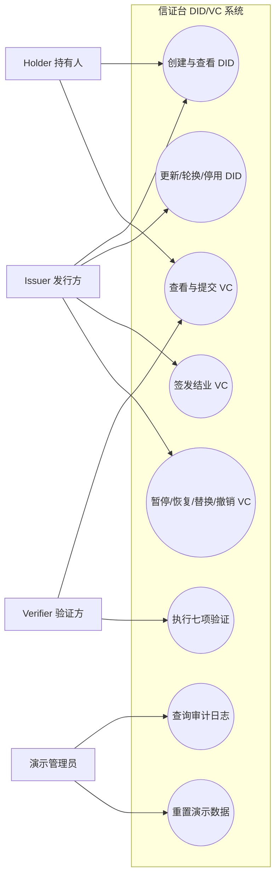
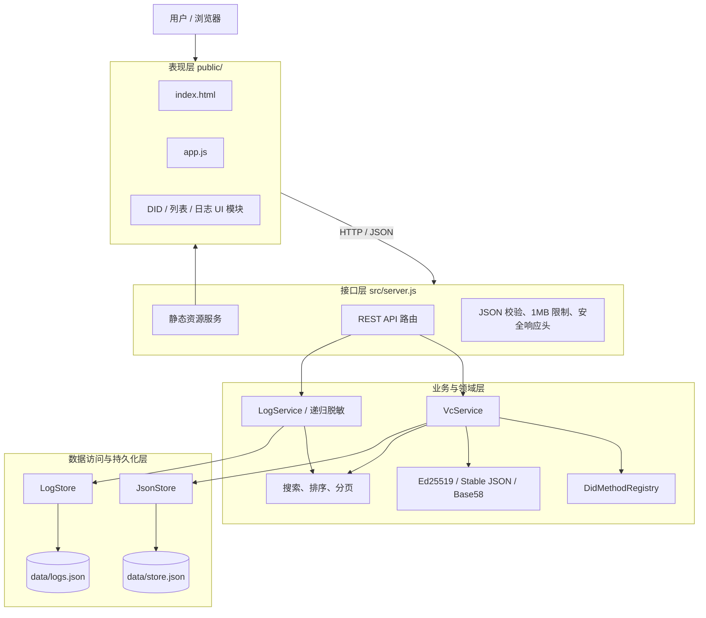
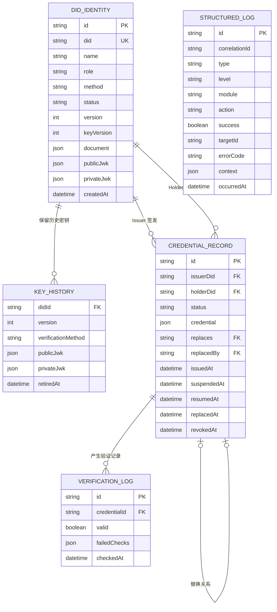
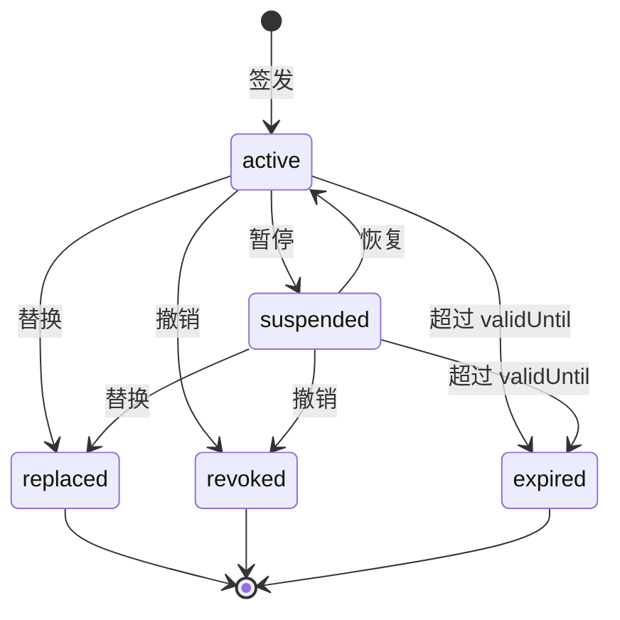
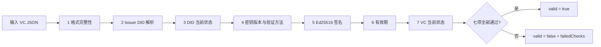
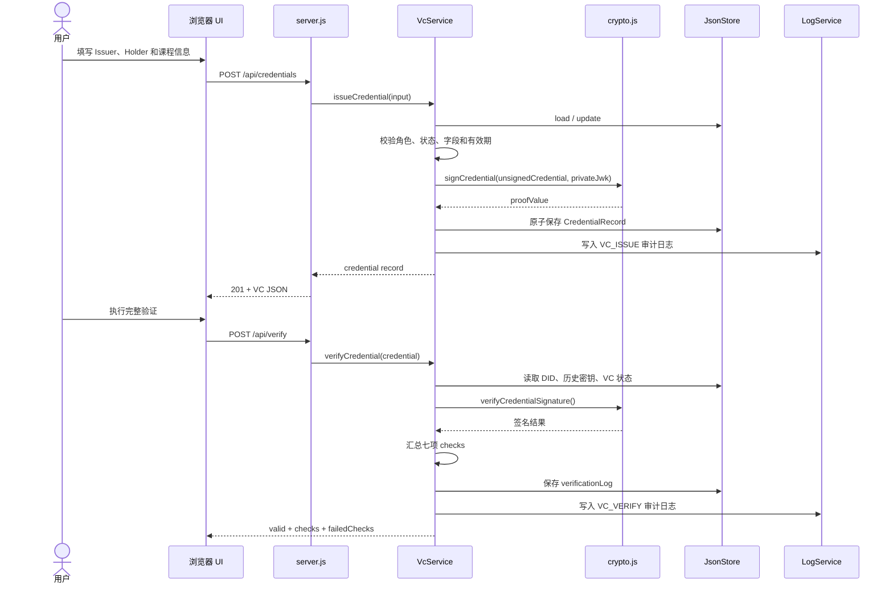
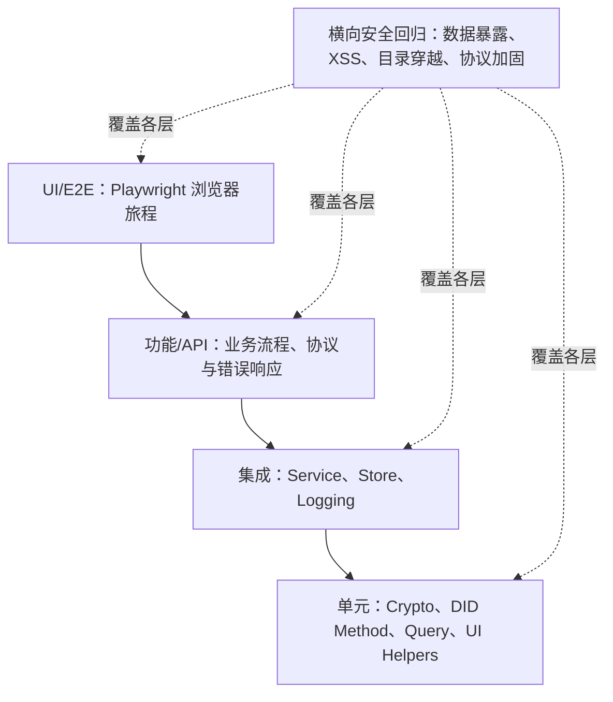
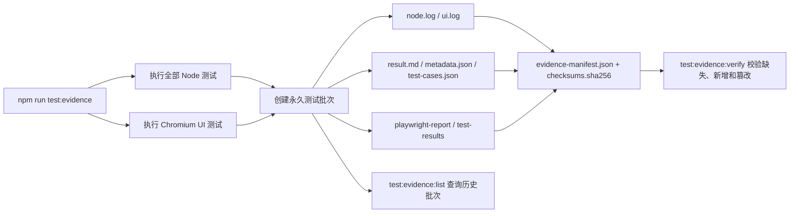
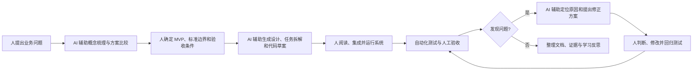

# 方案二（科班）：汇报内容细纲

> 用途：人工修改确认后，作为 HTML PPT 的内容与演讲备注来源。  
> 依据：当前仓库的 `src/`、`public/`、`test/`、`docs/` 与实际测试结果。  
> 注意：本文中的 Mermaid 代码可直接复制到支持 Mermaid 的 HTML/PPT 生成流程。

## 第一部分：软件工程汇报（A，00:00–10:00）

### 1. 项目概述（00:00–00:35）

#### 建议讲述

大家好，我们的项目是“信证台：DID/VC 本地演示系统”。系统以培训结业证书为业务场景，完成 Issuer 和 Holder 身份创建、VC 签发、七项验证、篡改检测、生命周期管理和审计追踪。

我们将按照软件工程过程介绍需求分析、总体设计、详细设计、编码实现和系统测试，然后进行产品全流程演示，最后汇报使用 AI 辅助开发和学习的过程。

#### 一句话目标

> 构建一个可解释、可操作、可测试的 DID/VC 本地教学系统，让“身份—签发—持有—验证—失效”形成完整闭环。

---

### 2. 需求分析（00:35–02:10）

#### 2.1 问题定义

传统电子证书常以图片或普通文件存在，验证者难以独立判断：

- 证书由谁签发；
- 内容是否被修改；
- 签发者身份当前是否有效；
- 证书是否过期、暂停、被替换或撤销；
- 操作过程是否能够审计。

本项目将这些问题转化为可执行的软件需求。

#### 2.2 用户角色

| 角色 | 业务职责 | 系统操作 |
|---|---|---|
| Issuer 发行方 | 创建机构身份、签发结业凭证 | 创建 DID、维护 DID、签发和管理 VC |
| Holder 持有人 | 接收和展示自己的凭证 | 创建 Holder DID、查看与提交 VC |
| Verifier 验证方 | 判断凭证是否可信且当前有效 | 提交 VC、查看七项验证结果 |
| 演示管理员 | 维护本地演示环境 | 重置数据、查询台账和日志 |

#### 2.3 功能需求

| 编号 | 功能模块 | 核心需求 |
|---|---|---|
| FR-01 | DID 管理 | 创建 `did:example`、`did:key`，查看 DID Document |
| FR-02 | DID 生命周期 | `did:example` 支持更新、密钥轮换和不可逆停用 |
| FR-03 | VC 签发 | Issuer 使用 Ed25519 私钥签发培训结业 VC |
| FR-04 | VC 验证 | 分别检查格式、Issuer、DID 状态、密钥版本、签名、有效期、VC 状态 |
| FR-05 | VC 生命周期 | 支持暂停、恢复、替换、过期和撤销 |
| FR-06 | 查询展示 | DID、VC、验证记录和日志支持搜索、排序、分页；签发页底部复用完整 VC 台账，验证页底部展示含中文失败原因的验证记录台账 |
| FR-07 | 审计日志 | 记录业务与系统操作，支持过滤、详情、脱敏和清理摘要 |
| FR-08 | 演示辅助 | 一键生成 Issuer、Holder 和初始 VC |

#### 2.4 非功能需求

| 类别 | 要求 | 实际措施 |
|---|---|---|
| 可运行性 | 无网络和数据库也能演示 | Node.js 原生 HTTP + 本地 JSON |
| 安全性 | 普通 API 不泄露私钥和敏感日志 | `publicDid()` 投影、递归脱敏、安全响应头 |
| 可靠性 | 减少并发写覆盖和半写文件 | 更新队列、临时文件写入后 rename |
| 可测试性 | 核心行为可自动验证 | 单元、集成、API、功能、安全、UI 分层测试 |
| 可解释性 | 验证失败原因可见 | 七项检查逐项返回结果 |
| 易用性 | 适合答辩现场操作 | 单页工作区、一键重置、搜索分页 |

#### 2.5 用例图

#### 2.6 范围边界

系统参考 DID Core 和 VC Data Model 2.0 的核心结构，但属于教学实现：不接入真实区块链，不进行真实身份核验，不提供生产级密钥托管，也不宣称兼容正式注册的 Data Integrity cryptosuite。

---

### 3. 总体设计（02:10–03:40）

#### 3.1 架构选择

采用本地 B/S 架构：浏览器运行原生 HTML/CSS/JavaScript；Node.js 提供静态资源和 REST API；业务状态与结构化日志分别保存为 JSON 文件。

选择理由：

- Node.js 20 内置 Ed25519 和 HTTP 能力，运行时无需第三方依赖；
- 单机本地服务减少网络、数据库和部署环境对答辩的影响；
- JSON 文件便于查看、重置和教学说明；
- 前后端通过 HTTP/JSON 分离，仍可进行接口与端到端测试。

#### 3.2 总体架构图

#### 3.3 模块职责

| 模块 | 文件 | 职责 |
|---|---|---|
| 表现层 | `public/index.html`、`public/*.js` | 导航、表单、台账、验证结果和日志界面 |
| HTTP 接口 | `src/server.js` | 静态资源、API 路由、输入限制、错误映射 |
| DID Method | `src/did-methods.js` | Example/Key Adapter 和 Method 注册 |
| 密码学 | `src/crypto.js` | Base58、稳定序列化、Ed25519 签名验签 |
| 领域服务 | `src/vc-service.js` | DID/VC 规则、生命周期和七项验证 |
| 查询 | `src/query.js` | 模糊搜索、稳定排序、分页边界修正 |
| 业务存储 | `src/store.js` | JSON 原子写入、更新串行化、公开投影 |
| 日志 | `src/log-service.js`、`src/log-store.js` | 日志结构、脱敏、过滤、留存和持久化 |

---

### 4. 详细设计（03:40–05:40）

#### 4.1 数据模型说明

项目没有关系型数据库，下面 ER 图是对 `store.json` 和 `logs.json` 中领域对象的逻辑建模，不表示实际建立了 SQL 表。

#### 4.2 DID Method 详细设计

| 项目 | `did:example` | `did:key` |
|---|---|---|
| 标识生成 | 本地随机标识 | Ed25519 公钥 + `0xed01` multicodec + Base58btc |
| 更新 | 支持 | 不支持 |
| 密钥轮换 | 支持，旧密钥进入 `keyHistory` | 不支持 |
| 停用 | 支持且不可逆 | 不支持 |
| 设计意义 | 演示注册型 DID 生命周期 | 演示公钥衍生型不可变 DID |

#### 4.3 VC 状态机

设计约束：`replaced`、`revoked`、`expired` 为终态；替换不是覆盖旧 VC，而是创建新 ID 并维护 `replaces`、`replacedBy`。

#### 4.4 七项验证流程

七项独立执行，最终使用 `checks.every(item => item.passed)` 汇总。签名正确只证明来源和完整性，不代表凭证当前仍有效。

---

### 5. 编码实现（05:40–07:15）

#### 5.1 签发与验证时序图

#### 5.2 关键实现点

| 实现点 | 方法 | 解决的问题 |
|---|---|---|
| 确定性签名载荷 | `stableStringify()` 递归排序对象键 | 避免同一对象因键顺序不同导致验签不一致 |
| Ed25519 签名 | Node.js `sign()` / `verify()` | 验证凭证来源与内容完整性 |
| 历史密钥验证 | proof 保存 `keyVersion`，DID 保存 `keyHistory` | 密钥轮换后仍能验证历史 VC |
| 状态机约束 | `VC_TRANSITIONS` + `assertVcTransition()` | 拒绝非法和终态转换 |
| 并发写保护 | Promise 更新队列 | 避免本地并发更新互相覆盖 |
| 原子文件写入 | 写 `.tmp` 后 `rename()` | 降低半写文件风险 |
| 私钥公开隔离 | `publicDid()` 移除当前与历史私钥 | 防止状态 API 向浏览器暴露私钥 |
| 日志脱敏 | 按 private/token/proof 等字段递归替换 | 避免审计日志保存敏感内容 |

#### 5.3 HTTP 与安全边界

- 只监听 `127.0.0.1`，默认端口 4173；
- 写接口必须使用 `application/json`；
- 请求体最大 1 MB；
- 静态文件路径规范化并拒绝目录穿越；
- 响应带 CSP、Referrer-Policy、`X-Content-Type-Options`；
- 前端渲染用户和日志文本时进行 HTML 转义。

---

### 6. 系统测试（07:15–09:15）

#### 6.1 测试策略图

#### 6.2 测试内容

| 测试层 | 主要覆盖 |
|---|---|
| 单元测试 | Stable JSON、Base58、Ed25519、DID Method、查询分页、脱敏和 UI Helper |
| 集成测试 | JSON Store、日志存储、DID/VC Service、状态机和历史密钥 |
| API 测试 | DID/VC CRUD、生命周期、错误 JSON、未知路由、分页响应 |
| 功能测试 | 四种 Method 组合、篡改、轮换、停用、暂停恢复、替换撤销 |
| 安全测试 | 私钥泄露、日志敏感字段、XSS、原型污染、目录穿越、安全响应头 |
| UI 测试 | 43 条 Chromium 用例覆盖导航、身份、签发、双 VC 台账、验证记录与失败原因、生命周期、日志、异常提示和桌面/移动布局 |

#### 6.3 可验证测试证据链

每个证据批次记录 Git 分支与提交、工作区是否干净、Node/npm/Playwright/Chromium 环境、各阶段退出码、通过/失败/跳过数量以及完整原始输出。只有所有阶段退出码为零、结果可解析、失败/跳过/todo 均为零且证据文件完整时，批次才标记为通过。

#### 6.4 当前验证结果

- 最新代码已实际复核 `npm run test:node`：124 项，124 项通过，本轮约 2.4 秒；
- 仓库上一轮执行记录为 43 项 Chromium UI 测试全部通过；本轮环境未安装项目 Playwright 依赖，正式汇报前需要复跑；
- proof 篡改旅程采用确定性字符切换，连续稳定性执行 20 次全部通过；
- UI 测试由 `playwright.config.js` 启动本地测试服务；当前只声明 Chromium 验证，不声明跨浏览器兼容；
- 正式汇报建议分别使用 `npm run test:node` 与 `npm run test:ui`，避免将默认 `npm test` 的文件发现行为与分层测试结果混在一起。
- 最终验收建议执行 `npm run test:evidence`，再用 `npm run test:evidence:verify -- <批次目录>` 校验证据完整性。

#### 6.5 缺陷闭环实例

提交历史显示项目通过测试发现并修正过：

- Base58 编码边界问题；
- JSON Store 并发更新序列化问题；
- Content-Type、请求大小和安全响应头问题；
- 测试运行记录与失败分析问题；
- 搜索、清空、分页和布局一致性问题。

正式汇报前建议选择其中一个真实案例，按“问题—测试证据—原因—修改—回归结果”讲解。

---

### 7. 项目评价与交接（09:15–10:00）

#### 优势

- DID/VC 核心业务闭环完整；
- 业务规则、密码学、接口、存储、日志和 UI 分层清晰；
- 验证结果可解释，适合教学；
- 自动化测试覆盖正常、异常、生命周期和安全场景；
- 无数据库、区块链和网络依赖，便于本地演示。

#### 局限

- 本地 JSON 未加密，只适合单机教学数据；
- 没有账号认证、权限控制和真实身份核验；
- DID 注册表和 VC 状态不是跨机构网络；
- proof 为教学实现，不是生产级 W3C Data Integrity 互操作实现；
- 系统仍是单机教学实现；UI 自动化只验证 Chromium，未进行跨浏览器兼容认证。

#### 交接话术

前面从软件工程角度介绍了系统如何从需求落实到设计、代码和测试。接下来由 B 使用真实系统，验证身份查看、凭证签发、七项验证、篡改检测和完整 VC 生命周期。

---

## 第二部分：产品全流程演示（B，10:00–17:00）

| 时间 | 操作 | 讲解重点 | 成功标志 |
|---|---|---|---|
| 10:00–10:25 | 重置演示数据 | API 真实创建 Issuer、Holder、VC | 总览出现 2 个 DID 和初始 VC |
| 10:25–11:10 | 查看 DID Document | Issuer 用 `did:example`，Holder 用 `did:key`；公开数据没有私钥 | 能看到公钥、verificationMethod、capabilities |
| 11:10–11:55 | 签发新 VC | issuer、subject、有效期、proof、keyVersion | 台账新增 active VC |
| 11:55–12:45 | 正常验证 | 七项检查全部执行，不只是密码学验签 | valid=true，七项通过 |
| 12:45–13:20 | 篡改姓名 | 文件可以被改，但篡改可以被检测 | signature 失败 |
| 13:20–14:25 | 暂停并恢复 | 暂停时签名仍正确但状态失败；恢复后重新有效 | suspended 失败，active 成功 |
| 14:25–15:20 | 替换凭证 | 生成新 ID，旧 VC 进入 replaced，保留历史关系 | 新 VC active，旧 VC replaced |
| 15:20–16:10 | 撤销新 VC | 撤销是不可逆终态 | 签名可通过但 credentialStatus 失败 |
| 16:10–17:00 | 查看日志 | 业务操作、失败检查、correlationId 和脱敏详情 | 可找到刚才的操作记录 |

### 演示备用原则

- 原始 VC 在篡改前单独保存，后续暂停、恢复验证使用原始 JSON；
- 替换后的新 VC 立即打开或复制，供撤销后验证；
- 超时则减少 JSON 字段解释，不删除暂停、恢复、替换、撤销四个核心动作；
- DID 更新、轮换、停用和搜索分页由前半段设计图及测试结果证明，不在现场逐项操作。

---

## 第三部分：AI 辅助开发过程（B，17:00–19:35）

### 1. AI 协作闭环图

### 2. AI 在各阶段的作用

| 软件工程阶段 | AI 辅助内容 | 人工负责内容 | 项目证据 |
|---|---|---|---|
| 需求分析 | 解释 DID/VC、整理角色与用例、补充边界条件 | 确定课程场景、MVP 和验收优先级 | PRD、MVP 范围、方法选型文档 |
| 总体设计 | 比较架构与技术方案、拆分模块 | 决定本地 Node.js + JSON 架构 | 开发方案与任务拆解 |
| 详细设计 | 生成状态机、验证规则、接口和数据结构草案 | 审核标准边界与业务合法性 | specs、plans、测试用例 |
| 编码实现 | 生成函数草案、重构建议和异常处理 | 阅读代码、合并模块、运行和修正 | `src/`、`public/`、Git 提交 |
| 系统测试 | 补充测试场景、分析失败输出 | 判断测试是否有效、复现并验收 | `test/`、缺陷报告、带 SHA-256 的证据批次 |
| 文档交付 | 整理 README、交付总结和汇报结构 | 核实事实、修正表述、承担最终结论 | `docs/`、README |

### 3. 推荐讲述的真实迭代案例

可以选择“JSON Store 并发更新”作为案例：

1. 初始实现能够完成单次保存，但并发服务请求可能发生读取同一旧状态后相互覆盖；
2. 测试和代码检查暴露了并发写入风险；
3. AI 辅助分析后提出用 Promise 队列串行化 read-modify-write；
4. 人工检查实现，并保留临时文件写入后 rename 的原子替换；
5. 集成测试验证并发创建的两个身份都能保存；
6. 修复进入提交历史，形成可追溯证据。

也可选择 Base58、Content-Type 或搜索分页案例，但必须与真实提交和测试一致。

### 4. AI 使用边界

- AI 可能混淆教学实现与正式标准，需要人工核对；
- AI 生成的正常路径代码不代表已经覆盖错误输入、并发和终态；
- 代码能运行不等于设计正确，测试通过也不等于测试一定充分；
- 最终需求取舍、代码审查、运行验证和汇报结论由成员负责。

### 5. 学习收获

- 从概念学习提升为能够解释 DID Document、Method 和 VC 生命周期；
- 从“页面能运行”提升为使用状态机、接口契约和测试证明行为；
- 理解签名有效、身份有效、时间有效和凭证状态有效是不同检查；
- 学会使用 AI 加速分析和实现，同时建立人工校验闭环。

---

## 第四部分：总结（19:35–20:00）

#### 建议讲述

本项目的技术成果，是完成了 DID 身份、VC 签发、七项验证、完整生命周期和审计日志组成的本地系统；工程成果，是走完了需求、设计、编码、测试和交付过程；学习成果，是形成了由人确定目标、AI 辅助实现、测试提供证据、人工完成判断的人机协作方法。我们的汇报到这里，谢谢大家。

---

## 人工修订清单

- [ ] 补充两位成员姓名和真实分工
- [ ] 核实最初需求和 AI 提问方式，删除未真实发生的表述
- [ ] 选定一个真实缺陷闭环案例，并准备提交或测试截图
- [x] 最新 Node 测试已复核为 124/124
- [ ] 正式汇报环境安装 Playwright，再次执行 Node 与 Chromium UI 测试
- [ ] 执行 `npm run test:evidence` 并保存最终证据批次
- [ ] 用 `npm run test:evidence:verify -- <批次目录>` 确认证据未被修改
- [ ] 为 ER 图注明“逻辑数据模型，实际使用 JSON”
- [ ] 对所有 Mermaid 图进行 PPT 尺寸试排，避免文字过小
- [ ] 产品演示至少完成两次 7 分钟计时彩排
- [ ] 人工确认后再生成 HTML PPT

