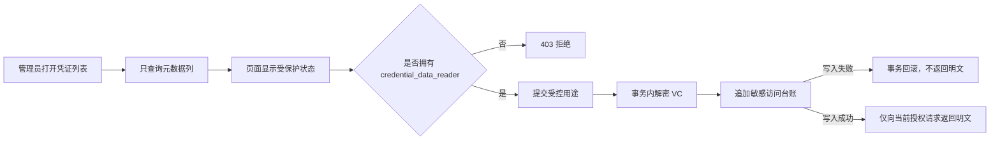

# DID/VC 系统生产安全评估与整改（V5）

## 1. 结论

整改前不能称为生产安全：虽然私钥、完整 VC、披露材料和验证证据已经在 MySQL 中使用 AES-256-GCM 加密，VC 也有 Ed25519 签名，但 V2 列表接口会读取并解密每张凭证，`tenant_admin` 又隐式继承 Issuer、Holder、Verifier 权限，导致管理员刷新页面即可批量看到个人声明。

整改后已经消除“管理员默认看明文”和“列表批量解密”两条主要风险，但系统仍处于生产化过渡阶段。正式上线前还需接入企业身份提供方、外部 KMS/HSM、可信 TLS 反向代理、用户与 Holder DID 控制权绑定，以及面向接收方的应用层加密封装。

## 2. DID Document 与 VC 的安全边界

| 对象 | 是否应当明文 | 原因 |
|---|---|---|
| DID、验证方法和公钥 | 是 | 验证方必须解析这些公开材料才能验签；公开公钥不等于公开私钥 |
| DID 私钥 | 否 | 只允许在 KMS 边界内解密并用于签名 |
| VC 元数据（ID、状态、有效期、Issuer/Holder 外键） | 可按权限公开 | 生命周期查询和索引需要，不包含个人声明正文 |
| VC `credentialSubject` 和完整 `proof` | 默认否 | 属于敏感正文，只能在业务授权后按需使用 |
| 选择性披露材料、盐、验证证据 | 否 | 可能泄露未公开声明或形成关联线索 |

DID Document 的明文是协议需要，不应为了“看起来加密”而整体隐藏。VC 则需要同时具备签名、防泄露存储、TLS 传输、最小披露和按用途访问控制。

## 3. 管理员是否应直接看到 VC

不应默认看到。`tenant_admin` 的职责是组织、成员、配置、审计和可用性管理，不等于个人数据读取授权。生产系统必须遵守：

1. 管理权限与业务数据权限分离；
2. 列表只返回非敏感元数据；
3. 完整正文读取使用独立角色 `credential_data_reader`；
4. 每次读取必须提供受控用途代码；
5. 读取和审计写入处于同一事务，审计失败则不返回明文；
6. 生产管理员默认不拥有 Issuer、Holder、Verifier 或敏感读取角色。

本地演示账号可以通过显式配置获得多个角色，但这是演示特例，不能复制到生产部署。

## 4. 已完成整改

### 4.1 默认不解密

`CredentialRepository.list()` 的 SQL 不再使用 `SELECT *`，也不读取 `encrypted_payload`。列表和 `/api/v2/state` 仅返回状态、时间、关联 ID、版本和能力标记，前端显示“受保护的凭证主体”。

### 4.2 敏感正文按需读取

完整 VC 只能通过以下接口读取：

```http
POST /api/v2/credentials/{credentialId}/content-access
Authorization: Bearer ...
Content-Type: application/json

{"purpose":"holder_review"}
```

允许的用途是固定枚举：`holder_review`、`issuer_support`、`verification_preparation`、`legal_audit`、`local_demo`。自由文本不能作为用途，避免把新的个人信息写入日志。

### 4.3 强制访问证据链

V5 新增 `v2_sensitive_access_logs`，记录租户、操作人、凭证、用途、请求关联 ID 和时间。正文与审计写入在同一个 Unit of Work 中完成；台账写入失败时事务回滚，调用者得不到明文。

租户管理员可通过 `GET /api/v2/sensitive-access-logs` 审查访问元数据，但该接口不返回 VC 正文。

### 4.4 职责分离

| 角色 | 权限 |
|---|---|
| `tenant_admin` | 组织管理、DID 管理、审计管理，不自动读取 VC 正文 |
| `issuer_operator` | 签发和生命周期操作 |
| `holder_operator` | 生成选择性披露或 SD-JWT |
| `verifier_operator` | 执行验证 |
| `credential_data_reader` | 在明确用途和强制审计下读取完整 VC |

### 4.5 生产配置防误用

当 `NODE_ENV=production` 时，系统强制要求：

- `APP_DATA_MODE=v2`；
- `REQUIRE_HTTPS=true`；
- `DB_SSL=true`；
- 禁止 `AUTH_LOCAL_DEV_LOGIN=true`。

所有 JSON API 响应增加 `Cache-Control: no-store` 和 `Pragma: no-cache`，避免浏览器或中间缓存保存敏感响应。本地演示重置接口在未启用本地登录时不可用。

## 5. 整改后的数据流



## 6. 仍未完成的生产边界

当前验证接口在受认证、授权和 TLS 保护的 API 边界内接收明文 VC。TLS 已是生产必需条件，但系统尚未实现“只允许指定 Verifier 解密”的应用层密文封装。下一阶段应采用独立于 Ed25519 签名密钥的 X25519 `keyAgreement` 密钥，执行“Issuer 先签名、发送方再为指定 Verifier 加密、Verifier 先解密再验签”。

在该能力完成前，不能宣称系统具备端到端加密或管理员不可见；只能准确表述为：数据库静态加密、私钥 KMS 隔离、API 强制 TLS、默认不解密、敏感读取最小权限与强制审计。
