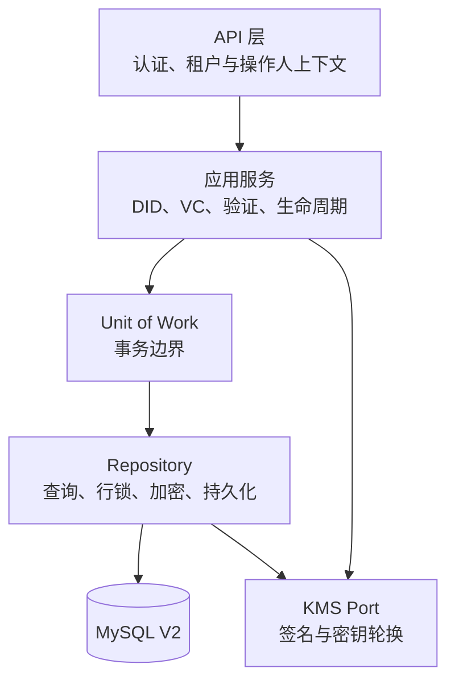
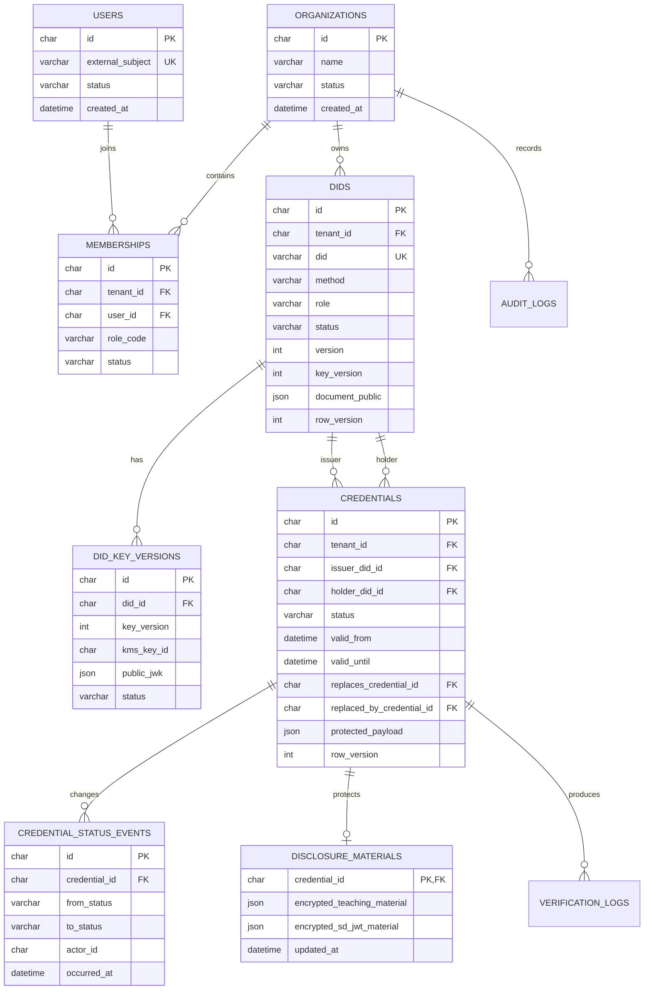

# 生产级数据层重构方案 V2

> 状态：V2 数据链路已实施并完成本地验收。
> V1 表仍保留作为回滚边界；本地运行入口已切换为 `APP_DATA_MODE=v2`。

## 1. 目标与范围

当前 MySQL 实现已经将数据从 JSON 文件迁入数据库，并对部分载荷进行 AES-256-GCM 加密；但仍保留 `load → 修改内存 state → DELETE 全表 → 重写` 的教学型访问方式。V2 的目标是：

- 所有读写通过领域仓储（Repository）完成，应用服务不再操作完整 state 或 SQL；
- 以 MySQL 事务、行锁和乐观锁保证 DID、VC、台账和审计的一致性；
- 支持多租户 ToB/B2B2C：每项业务数据都归属组织，并由操作人上下文过滤；
- 保护私钥、个人声明、盐和 Disclosure，保留必要的可检索字段；
- 将日志和验证记录改为仅追加，不再清空重写。

非目标：本阶段不实现完整登录、OAuth/OIDC、BBS+、Holder Key Binding 或跨机构 DID 网络；但模型必须为这些能力预留边界。

## 2. 架构边界



### 2.1 分层职责

| 层 | 可以做什么 | 不可以做什么 |
|---|---|---|
| API | 解析认证信息、建立 `RequestContext`、校验输入、映射响应码 | 直接执行 SQL、决定业务状态迁移 |
| 应用服务 | 执行业务规则、组合多个 Repository、创建审计事件 | 读取全库 state、拼接 SQL、保管私钥 |
| Unit of Work | 开启/提交/回滚事务，向仓储传递 transaction | 包含具体领域规则 |
| Repository | 查询、分页、`SELECT … FOR UPDATE`、乐观锁、加密/解密、映射领域对象 | 决定“是否允许撤销”等领域规则 |
| KMS | 生成、轮换和使用签名密钥；返回公钥或签名 | 向 API 返回私钥 |

## 3. 请求上下文与租户隔离

每个受保护请求必须在进入应用服务前形成以下上下文：

```js
{
  requestId,       // 关联 API、验证台账和审计日志
  actorId,         // 当前用户或服务账号
  tenantId,        // 当前组织/租户
  // 角色不信任 Token 直传，由 tenantId + actorId 查询有效 membership 获得
  purpose,         // 验证目的或业务用途，可选
  occurredAt
}
```

业务 Repository 的读写方法均显式接收 `context` 或 `tenantId`。除平台级管理员的受控操作外，不允许无租户条件的业务查询。

## 4. V2 逻辑 ER 图



## 5. 表与数据保护策略

| 表 | 明文可检索列 | 加密载荷 | 关键索引 |
|---|---|---|---|
| `organizations` | `id`、`name`、`status` | 无或少量配置 | `name` 唯一约束（按产品策略） |
| `users` / `memberships` | 身份提供商 subject、租户、角色、状态 | 可选个人资料 | `(tenant_id, user_id)` 唯一索引 |
| `dids` | `tenant_id`、`did`、`method`、`role`、`status`、版本 | 非公开服务配置等 | `did` 唯一、`(tenant_id, role, status)` |
| `did_key_versions` | DID、版本、KMS Key ID、公开 JWK、状态 | 私钥仅在 KMS 加密区 | `(did_id, key_version)` 唯一 |
| `credentials` | 租户、Issuer/Holder 外键、状态、有效期、替换关系 | 完整 VC 正文及敏感 claims | `(tenant_id, status, valid_until)`、Issuer/Holder 外键索引 |
| `disclosure_materials` | 凭证 ID、更新时间 | 盐、教学版 claims、SD-JWT disclosures | `credential_id` 主键 |
| 验证/审计日志 | 租户、凭证、验证类型、结果、时间、动作 | 逐项检查证据和需保护的上下文 | `(tenant_id, occurred_at)`、`(credential_id, verification_kind)` |

规则：

1. 私钥不写入 `dids` 或 `credentials`；仅由 KMS 加密保存并通过 `kms_key_id` 引用。
2. `credentialSubject.name`、课程、盐、Disclosure 等进入加密 JSON；状态、时间、外键和版本作为索引列保留。
3. 日志默认脱敏；涉及个人字段的扩展上下文应加密或不落库。
4. 不以数据库全局加密替代应用层信封加密；两者可叠加。

## 6. Repository 与事务接口

```js
class UnitOfWork {
  async run(context, callback) { /* begin / commit / rollback */ }
}

class DidRepository {
  async findById(context, id) {}
  async findByDid(context, did) {}
  async getForUpdate(context, id) {}
  async create(context, did) {}
  async save(context, did, expectedRowVersion) {}
  async list(context, query) {}
}

class CredentialRepository {
  async findById(context, id) {}
  async getForUpdate(context, id) {}
  async create(context, credential) {}
  async saveStatus(context, credential, expectedRowVersion) {}
  async list(context, query) {}
}

class VerificationRepository {
  async appendCredentialVerification(context, record) {}
  async appendDisclosureVerification(context, record) {}
}

class AuditRepository {
  async append(context, event) {}
}
```

所有修改凭证状态的用例均在同一事务中执行：读取凭证并加锁 → 检查状态机与权限 → 更新状态/版本 → 写状态事件 → 写审计日志。验证记录采用 append-only，不需要锁定整个日志集合。

## 7. 并发与一致性

- DID 更新、密钥轮换、暂停/恢复/撤销/替换：`SELECT … FOR UPDATE` 加行锁，另使用 `row_version` 防止陈旧写入。
- `replaceCredential`：旧凭证状态变化、新凭证创建、双向替换关系、状态事件与审计必须同一事务提交。
- `validUntil` 过期：查询和验证时使用派生状态；可由定时任务将过期事件物化，但不能依赖定时任务才判定失效。
- `verification_logs`、`disclosure_verification_logs`、`audit_logs` 仅 `INSERT`，不允许“加载后裁剪再全表写回”。保留策略由批处理或分区策略实施。

## 8. 迁移顺序与兼容策略

1. 新建只追加的 `002-production-repositories.sql`，不修改已执行的 `001-initial.sql`。
2. 增加 V2 Repository，并为其编写 MySQL 集成测试与 Repository 契约测试。
3. 先把 DID、密钥和组织能力切到 V2；旧 JSON-State 代码暂保留。
4. 迁移 VC 与生命周期，再迁移披露材料和验证记录。
5. 提供一次性迁移命令：读取 V1 表/JSON，校验、加密、写入 V2，并输出可审计迁移报告。
6. 双读校验期内比较 V1/V2 查询结果；确认后将运行入口切到 V2。
7. 退役 V1 全量 State Store 和全表 `DELETE + INSERT` 写入逻辑。

## 9. 首批验收标准

- 任一 Repository 查询均带租户条件；跨租户 ID 不得读取或修改数据。
- 单次暂停、恢复、撤销、替换只更新涉及行，不重写无关 DID、VC 或日志。
- 并发状态变更只有一个成功，另一个返回版本冲突或非法转换。
- 私钥、盐、Disclosure 与完整敏感 claims 不出现在普通列表 API、审计日志或明文数据库列。
- 替换操作失败时不得留下“旧凭证已 replaced、但新凭证不存在”的中间状态。
- 原有 DID/VC、选择性披露和 SD-JWT 业务测试在 V2 Repository 后仍通过；新增租户、事务、并发和迁移测试。

## 10. 当前阶段的决策

本方案默认生产版是多租户 ToB/B2B2C 平台。若后续产品明确为单机构部署，仍保留 `tenant_id`，但只创建一个默认组织；这样不会阻碍后续多机构扩展。

## 11. 实施与验收记录（2026-07-13）

- 数据库已升级至 V4：组织、用户、成员关系、DID/密钥版本、VC/状态事件、披露材料、验证证据和加密审计日志均已落库。
- 前端已通过带租户与操作人上下文的 V2 API 访问数据；本地会话只为演示环境提供，不代表生产 OIDC/OAuth 登录已完成。
- 已验收完整 VC、教学版选择性披露和 SD-JWT 验证，验证结果统一追加到 `v2_verification_logs`，以 `verification_kind` 区分路线。
- 自动化结果：200 项 Node 测试通过；V2 真实 Chromium 全流程通过；数据库 V4 健康检查和 V1/V2 对账通过。
- 尚未生产化的边界：正式身份提供方、外部 KMS/HSM、跨机构协议与管理端/机构端/持有者端的独立产品界面。
