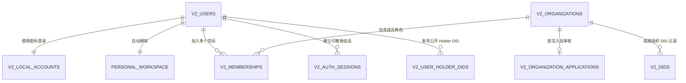
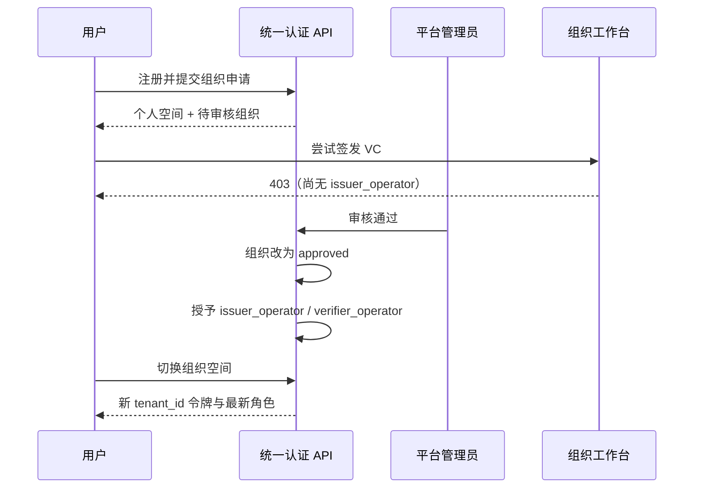
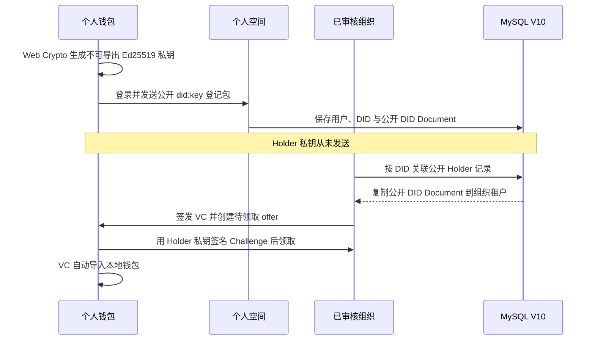

# 统一账号与多组织多租户 MVP

## 1. 目标与结论

系统不再把“个人”和“组织”设计成两套互斥账号。登录主体始终是自然人，一个自然人账号自动拥有一个个人空间，也可以创建或加入多个组织空间。

- 个人空间只管理账号关系、公开 Holder DID 与钱包入口；凭证持有、选择性披露和 Holder 签名只在个人钱包完成，私钥留在钱包 IndexedDB，不上传平台。
- 组织空间先进入 `pending`，审核前只有空间所有者和租户管理权限，不能签发或验证。
- 平台管理员使用独立平台角色审核组织；审核通过后，申请人才获得 Issuer 与 Verifier 角色。
- 组织业务数据按 `tenant_id` 隔离；每次 API 调用实时检查成员关系和组织状态。
- 登录令牌绑定用户、当前空间、可撤销会话和密码凭据版本，退出后旧令牌立即失效。

## 2. 四个产品界面

| 界面 | 使用者 | 主要职责 | 明确边界 |
|---|---|---|---|
| 信证台个人空间 `:5173` | 自然人账号 | 管理账号、组织关系、公开 Holder DID，并打开个人钱包 | 不保存完整 VC，不生成披露证明，不使用 Holder 私钥 |
| 个人钱包 `:5176` | 自然人 Holder | 本地生成不可导出私钥、发布公开 DID、领取 VC、选择性披露和本地签名 | 不保存 Issuer 私钥，不替组织签发 |
| 组织工作台 `:5173` | 组织成员 | Issuer DID、VC 签发、Verifier 验证、成员与角色管理、租户审计 | 不能读取 Holder 私钥，不能跨租户读数据 |
| 平台治理后台 `:5173/platform` | 平台管理员 | 审核组织入驻、管理平台级信任入口 | 平台角色不自动继承组织角色 |
| Node API `:4173` | 三类前端 | 认证、授权、事务、仓储、密码学调用与审计 | 不把数据库连接或密钥暴露给浏览器 |

## 3. 账号与空间关系



注册时若选择“同时创建组织”，系统在一个数据库事务里完成自然人用户、`scrypt` 密码凭据、个人空间、待审核组织、成员关系、组织申请和可撤销会话。任一步失败全部回滚。

## 4. 组织准入与授权



组织邀请使用 256 位随机令牌，数据库只保存 SHA-256 哈希；明文令牌只返回一次。受邀人必须使用邀请邮箱对应的统一账号接受。初始角色是 `organization_member`，后续由租户管理员显式授予：

| 角色 | 能力 |
|---|---|
| `issuer_operator` | 签发与管理本租户 VC |
| `verifier_operator` | 验证 VC、SD-JWT 和钱包绑定证明 |
| `credential_data_reader` | 受控读取敏感 VC 明文并写审计 |
| `tenant_admin` | 租户管理、DID 与审计操作 |

系统禁止移除最后一个租户管理员，普通角色接口不能转移或删除 `workspace_owner`。

## 5. Holder DID 与跨租户签发



`v2_user_holder_dids` 是公开 Holder DID 目录，不是密钥库。VC 和 offer 仍属于签发组织的 `tenant_id`，钱包收件箱依靠 Holder 对一次性 Challenge 的签名证明控制权。

## 6. 会话安全

- 密码采用 Node 内置 `scrypt`、16 字节随机盐和恒定时间比较；数据库不保存明文密码。
- 连续五次失败锁定 15 分钟。
- JWT 包含 `sub`、`tenant_id`、`sid`、`cv`、`iat`、`exp`。
- 每个受保护请求查询 `v2_auth_sessions`、用户状态和凭据版本；仅 JWT 签名正确不足以放行。
- 空间切换只改变当前租户，不改变登录主体；退出会把数据库会话设为 `revoked`。
- 生产环境仍要求 HTTPS、数据库 TLS、独立前端反向代理和 Secret/KMS 注入。

## 7. 数据库迁移与启动

V9 增加统一账号、个人/组织空间、组织申请、邀请、平台角色和会话；V10 增加用户控制的公开 Holder DID 目录。

```bash
npm install
npm run migrate
npm start
npm run frontend:dev
npm run wallet:dev
```

访问 `http://127.0.0.1:5173/login` 注册自然人账号；钱包位于 `http://127.0.0.1:5176`。平台管理员由部署人员显式授予：

```bash
npm run platform:grant-admin -- admin@example.com
```

该命令只能对已注册统一账号授予 `platform_admin`，不会创建密码或输出令牌。

## 8. 验证命令

```bash
npm run smoke:multitenant
npm test
npm run frontend:build
```

冒烟脚本使用真实 MySQL 和临时 HTTP 端口，验证注册、空间创建、审核前 403、平台审核、角色授予、钱包公开 DID、组织关联、邀请加入、成员授权、退出和令牌撤销。它会写入随机本地测试数据，不应在生产数据库执行。

## 9. MVP 边界

- 尚未实现邮箱验证、找回密码、MFA/Passkey、刷新令牌和设备会话管理；
- Web 钱包缺少移动端安全区和加密备份恢复；
- 邀请令牌尚未接邮件服务；
- 组织审核尚未接证照 OCR、人工复核和凭证 Schema 授权；
- 公开 Holder DID 目录尚未实现可见范围、联系人搜索和限流；
- 本地 EVM 是演示链，不等同于生产联盟链治理。
