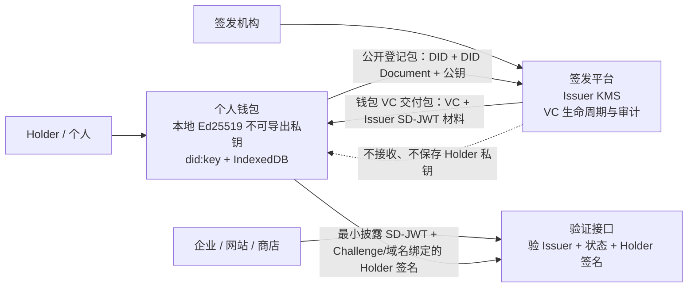
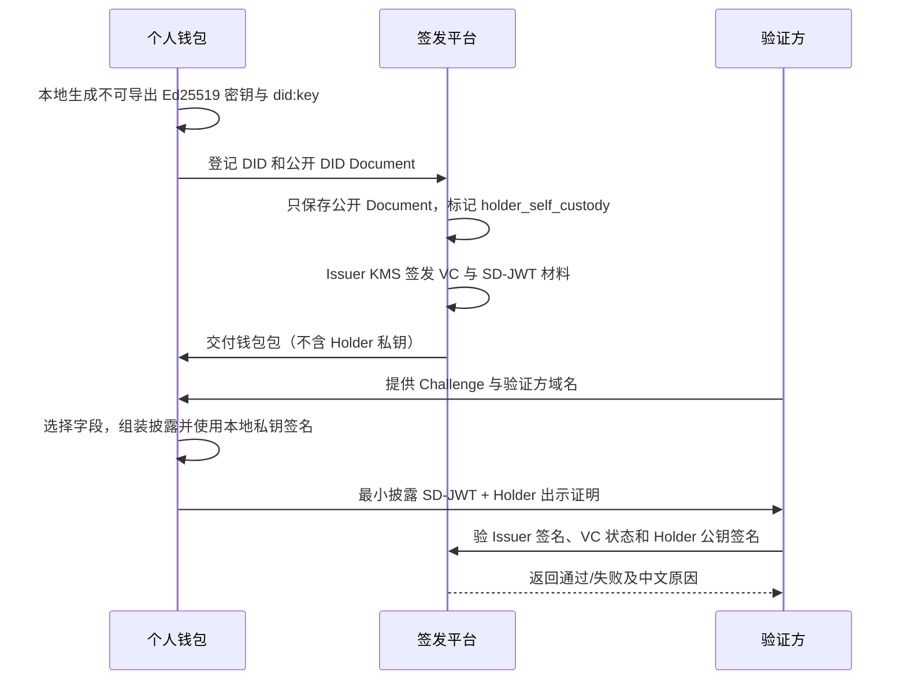

# 自托管身份钱包与多方凭证平台重构方案

> 状态：个人钱包 MVP 与验证方一次性 Challenge 台账已实施并完成自动化验证；生产级的跨设备恢复、正式 DID Registry、外部 HSM 仍在后续范围。

## 1. 结论与边界

答辩反馈指出：个人 Holder DID 的私钥不应由签发平台或管理员代管。数据库加密、KMS 隔离和访问审计可以保护服务端数据，但不能替代“用户控制私钥”。

当前实现已经按密钥归属拆分：

| 主体 | 已实现职责 | 私钥位置 | 平台是否可取得 |
|---|---|---|---|
| Holder（个人钱包） | 本地创建 `did:key`、接收 VC、选择披露、签名出示 | 浏览器 IndexedDB 中不可导出的 Web Crypto `CryptoKey` | 否 |
| Issuer（签发机构） | 创建机构 DID、签发 VC、交付钱包包、管理 VC 状态 | 机构侧 KMS 边界 | 仅按授权用于机构签名 |
| Verifier（验证方） | 验 Issuer 签名、VC 生命周期、Holder DID 与 Holder 出示签名 | 当前不需要私钥 | 不取得 Holder 私钥或完整钱包数据库 |

`DID Document`、DID 和公钥本来就是可公开验证材料；需要保护的是私钥、VC 中的个人声明、披露材料和业务访问权限。

## 2. 当前 MVP 架构

实现对应关系：

| 环节 | 代码/接口 | 安全约束 |
|---|---|---|
| 本地生成 Holder DID | `wallet/wallet-core.js` | `crypto.subtle.generateKey(..., false, ...)`，私钥不可导出 |
| 公开登记 | `POST /api/v2/holder-dids/registration` | 仅接受 `did:key` 公共 Document；不创建 `v2_did_key_versions` |
| 机构签发 | `POST /api/v2/credentials` | 服务端只可创建 `issuer` DID；Issuer 经 KMS 签名 |
| 钱包交付 | `POST /api/v2/credentials/:id/wallet-package` | 只返回 VC、Issuer JWT 和 disclosure；响应不含 `privateKey` |
| 本地出示 | `createWalletPresentation()` | 由 Holder 本地密钥签 `challenge`、`domain`、SD-JWT 和 DID |
| 验证 | `POST /api/v2/wallet-presentations/verify` | 校验 Issuer、状态、Holder 公钥、Holder 签名与绑定字段 |

## 3. 实际流程

Wallet 交付包的格式是 `wallet-vc-package-v1`。其内容包括完整 VC 和 Issuer 签名的 SD-JWT 披露材料，供钱包**本地**存储；它不含 Holder 私钥，也不会把钱包私钥上传到任何 API。

本课程 MVP 的 `WalletBoundSdJwtPresentation2026` 是“SD-JWT 披露 + Holder 本地 Ed25519 绑定签名”的教学扩展，不应宣称为正式 SD-JWT Holder Key Binding 规范实现。

## 4. 数据库与角色调整

- V6 迁移把 DID 的唯一约束改为“租户 + DID”，允许多个机构登记同一公开 Holder DID；V7 增加验证方 Challenge 哈希台账。
- 新登记的 Holder DID 元数据为 `keyCustody: holder_self_custody`；不会建立服务端密钥版本或 KMS Key。
- `V2DidService.createDid()` 只允许创建 `issuer`；Holder 必须由钱包经登记接口提交。
- 旧 `public/` 页面和 V1 兼容链路仅用于迁移回归，生产演示应使用 Vue V2 平台与独立 `wallet/`，不得把旧托管 Holder 流程当成产品能力。

## 5. 已验证证据

已完成以下自动化验证：

1. 单元测试：钱包本地密钥为不可导出，登记包和出示证明不出现 `privateKey`。
2. 集成测试：浏览器 Web Crypto 生成的 Holder 签名可被服务端用 DID Document 公钥验通过。
3. Chromium 端到端：钱包本地建 DID → 平台登记 → Issuer 签发 → 交付包导入 → 钱包最小披露 → 平台验证，全流程通过。
4. 回归：Node 测试、Vue 构建、数据库 V7 健康检查、V2 冒烟和 Chromium 钱包全链路测试通过。

## 6. 仍需完成的生产级能力

| 能力 | 当前状态 | 后续处理 |
|---|---|---|
| 跨设备恢复与遗失处理 | 未实现 | 原生钱包/系统安全区、加密备份与恢复流程 |
| Challenge 一次性消费 | 已实现 | 验证方只保存 SHA-256 哈希；首次成功验证时以原子更新消费 |
| 正式 SD-JWT Holder Key Binding | 教学扩展 | 对接标准库并实现标准 `cnf` / KB-JWT |
| DID Registry 与链上状态 | 本地平台登记 | 抽象 Registry，接入 DID Method 或联盟链锚定 |
| Issuer 外部 HSM | 本地 KMS 抽象 | 接入云 KMS/HSM、多管理员审批与轮换 |
| 定向加密交付 | 未实现 | Holder `keyAgreement`（X25519）与 JWE/HPKE |

## 7. 答辩表述

> 我们没有把“服务端加密保存 Holder 私钥”当作自主管理身份。当前 MVP 已把 Holder 密钥生成、保存和出示签名移到独立个人钱包，平台只登记公钥 DID Document；机构 Issuer 密钥才由 KMS 管理。钱包已能完成本地最小披露和 Holder 签名绑定，验证方 Challenge 以哈希入库并在首次成功验证后原子消费。正式 Registry、设备恢复和标准 Holder Binding 属于下一阶段，不能夸大为已经完成。
